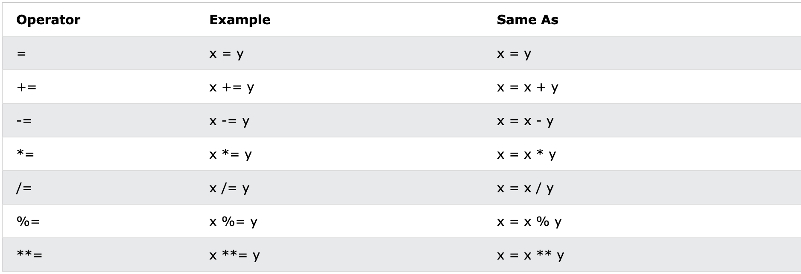
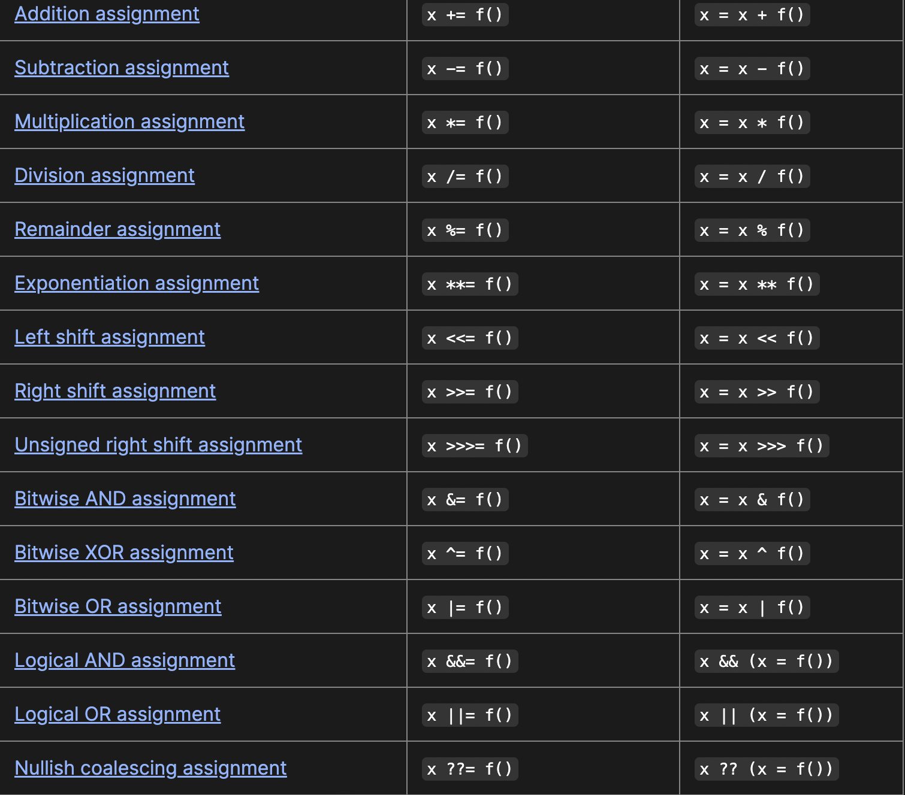
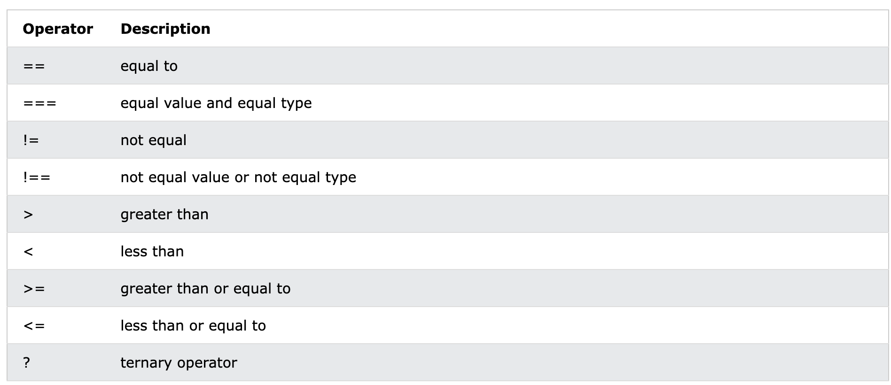
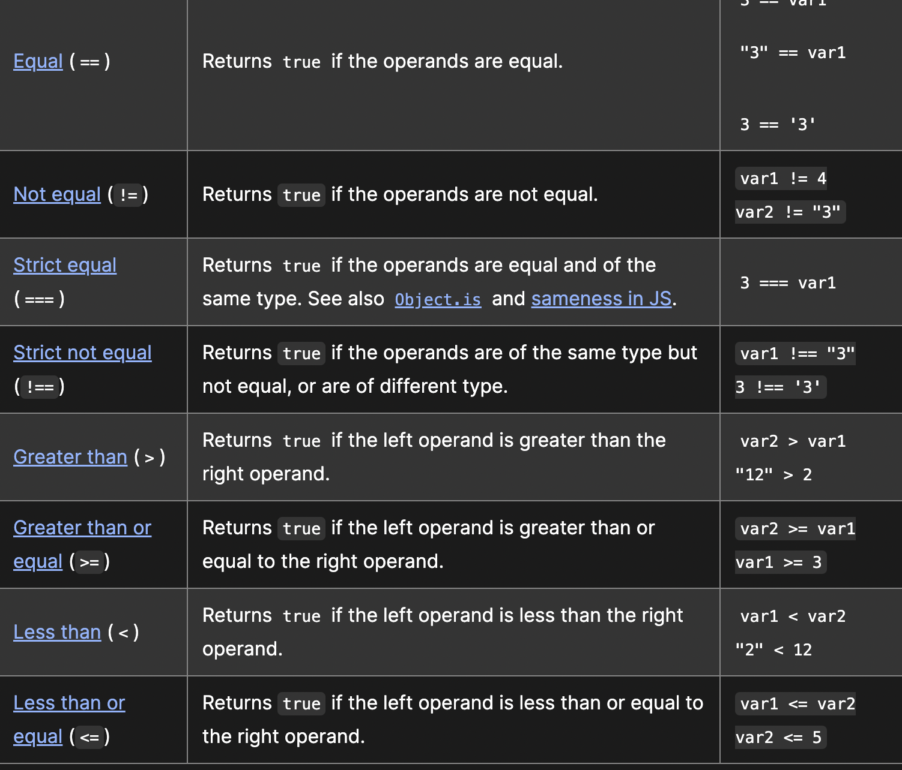

# Assignment Operators

Assignment Operators assign values to JavaScript variables.

Assignment Operators take numerical values (either literals or variables) as their operands and returns a single numerical value. The standard arithmetic operators are addition `(+)`, subtraction `(-)`, multiplication `(*)`, and division `(/)`. These operators work as they do in most other programming languages when used with floating point numbers (in particular, note that division by zero produces Infinity).

# Comparison Operators

A comparison operator compares its operands and returns a logical value based on whether the comparison is true. The operands can be numerical, string, logical, or object values. In most cases, if the two operands are not of the same type, JavaScript attempts to convert them to an appropriate type for the comparison. This behavior generally results in comparing the operands numerically. The sole exceptions to type conversion within comparisons involve the `===` and `!==` operators, which perform strict equality and inequality comparisons. 

## For loop

Syntax:

`for (statement 1; statement 2; statement 3) {`

  `execute code block`

`}`

- Statement 1 is executed once before the code block is run.

- Statement 2 defines the condition needed to execute the code block.

- Statement 3 is executed every time the code block is run.

Example of real code

`for (let i = 0; i < 10; i++) {`

 `console.log(i);`

`}`

- This loop will print numbers 0-9, will stop when condition is met (i = 10)

- Statement 1 sets the variable for the loop (let i = 0).

- Statement 2 sets the loop condition (i < 10).

- Statement 3 increases the value of i (i++) each time the code block is run.

- This loop will print numbers 0-9, will stop when condition is met (i = 10)

### While loop

Syntax

`while (condition) {`

  `execute code block`

`}`

- The code block will continue to loop as long as the condition is true.

Example of real code:

`let i = 0;`

`while (i < 5) {`

  `console.log(i);`

  `i++;`

`}`

This loop will print number 0-4, will stop when condition becomes false (i >=5)

For the above example, the syntax is as follows:

The code block will continue to run as long as the variable (i) is less than 5.

[Back to home page](../../README.md)