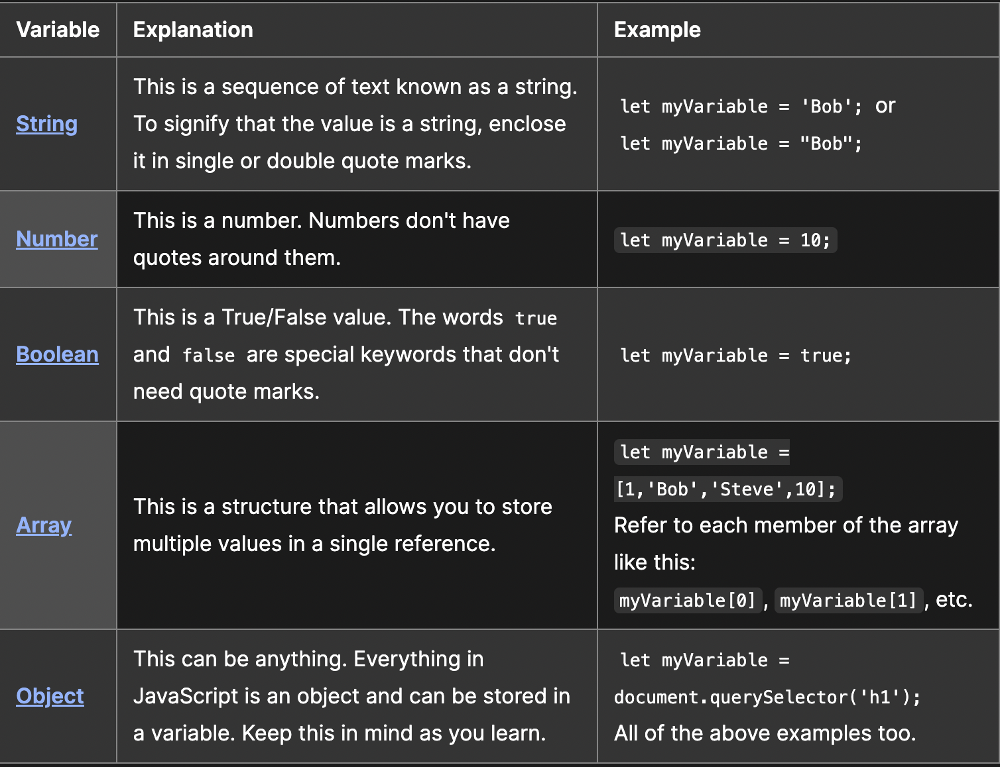
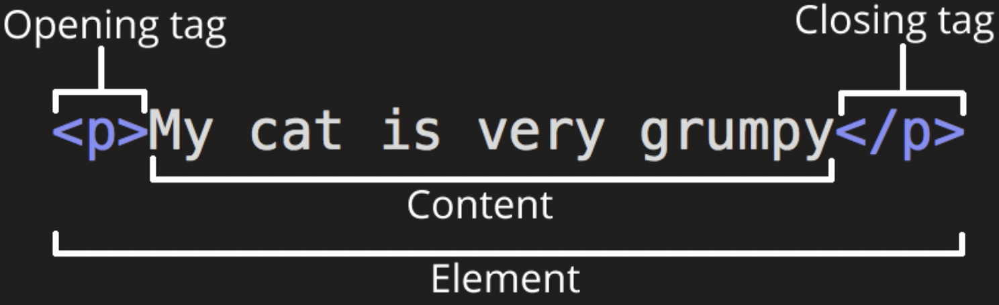
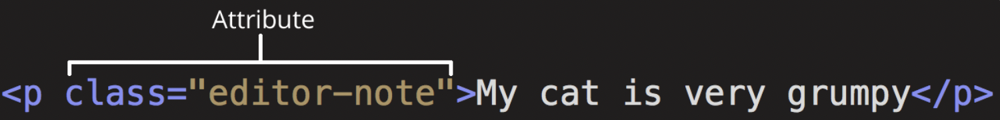
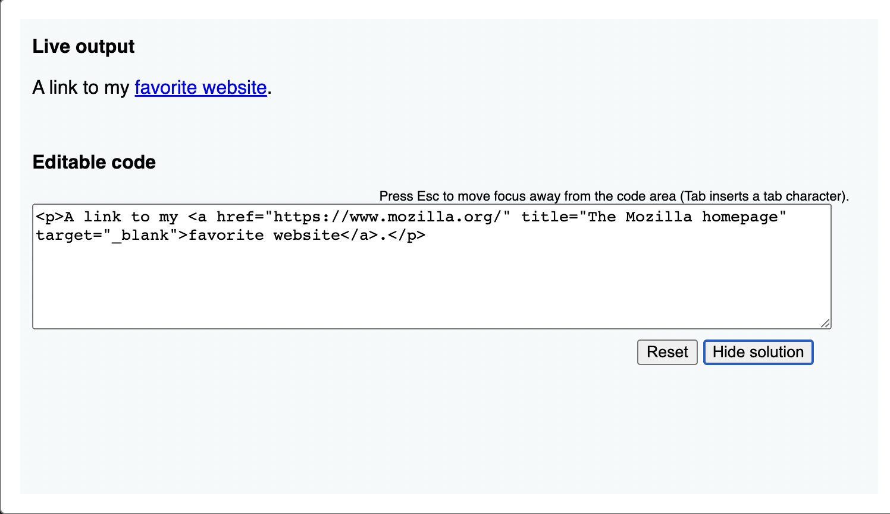
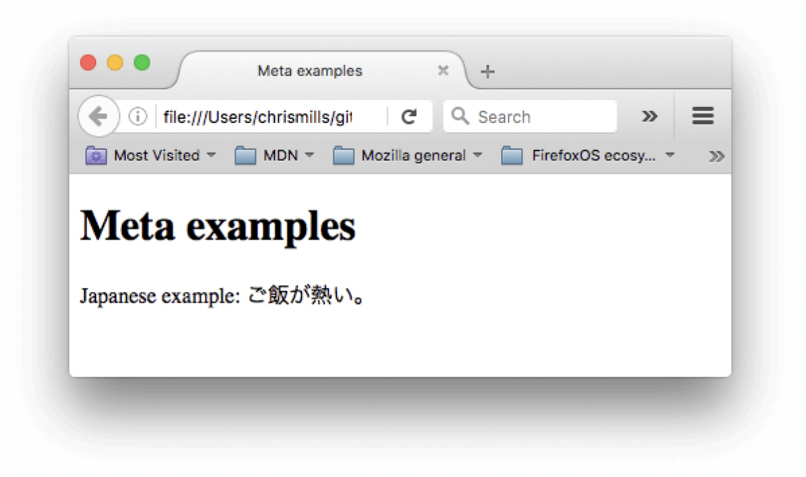

# Class 01

Computers connected to the internet are called clients and servers

Clients are internet-connected devices(phone and computers) and web-accessing software available on those devices (usually a web browser like Firefox or Chrome).

Servers are computers that store webpages, sites, or apps. When a client device wants to access a webpage, a copy of the webpage is downloaded from the server onto the client machine to be displayed in the user's web browser.

In addition to the client and the server, we also need:

* Your internet connection: Allows you to send and receive data on the web.

* `TCP/IP`: Transmission Control Protocol and Internet Protocol are communication protocols that define how data should travel across the internet.

* `DNS`: Domain Name System is like an address book for websites. When you type a web address in your browser, the browser looks at the DNS to find the website's IP address before it can retrieve the website.

* `HTTP`: Hypertext Transfer Protocol is an application protocol that defines a language for clients and servers to speak to each other.

* `Component files`: A website is made up of many different files, which are like the different parts of the goods you buy from the shop.
  * `Code files`: Websites are built primarily from HTML, CSS, and JavaScript, though you'll meet other technologies a bit later.

  * `Assets`: This is a collective name for all the other stuff that makes up a website, such as images, music, video, Word documents, and
    PDFs.

## Poem about HTTP

* In the vast expanse of cyberspace,
* Where information flows with grace,
* There lies a protocol, robust and sound,
* That connects us all, without a bound.

* Hypertext Transfer Protocol is its name,
* Or HTTP, for short, it came,
* It's the language of the web we see,
* That helps us browse, with such great glee.

* It's the foundation of the world wide web,
* And all the sites that it embeds,
* It lets us click and explore with ease,
* And find the content that we please.

* With every page, it sends a request,
* And retrieves the data, without a rest,
* It keeps us connected, day and night,
* And helps us learn, with such great might.

* So here's to HTTP, our guide,
* That helps us journey, far and wide,
* Through the endless maze of the internet,
* And find the knowledge, we never met.

## What happens?

1. The browser goes to the DNS server, and finds the real address of the server that the website lives on.
2. The browser sends an HTTP request message to the server, asking it to send a copy of the website to the client
3. This message, and all other data sent between the client and the server, is sent across your internet connection using TCP/IP.
4. If the server approves the client's request, the server sends the client a "200 OK" message, which means "Of course you can look at that website! Here it is", and then starts sending the website's files to the browser as a series of small chunks called data packets
5. The browser assembles the small chunks into a complete web page and displays it to you

## Order of files

When browsers send requests to servers for HTML files, those HTML files often contain `<link>` elements referencing external CSS stylesheets and `<script>` elements referencing external JavaScript scripts.

1. The browser renders the HTML file first, and that leads to the browser recognizing any `<link>`-element references to external CSS stylesheets and any `<script>`-element references to scripts.

2. As the browser render the HTML, it sends requests back to the server for any CSS files it has found from `<link>` elements, and any JavaScript files it has found from `<script>` elements, and from those, then parses the CSS and JavaScript.

3. The browser generates an in-memory DOM tree from the parsed HTML, generates an in-memory CSSOM structure from the parsed CSS, and compiles and executes the parsed JavaScript.

4. As the browser builds the DOM tree and applies the styles from the CSSOM tree and executes the JavaScript, a visual representation of the page is painted to the screen, and the user sees the page content and can begin to interact with it.

## DNS

These are special servers that match up a web address you type into your browser (like "mozilla.org") to the website's real (IP) address.

Websites can be reached directly via their IP addresses. You can use a DNS lookup tool to find the IP address of a website.

## Packets

The term "packets" to describe the format in which the data is sent from server to client. Basically, when data is sent across the web, it is sent in thousands of small chunks. There are multiple reasons why data is sent in small packets. They are sometimes dropped or corrupted, and it's easier to replace small chunks when this happens. Additionally, the packets can be routed along different paths, making the exchange faster and allowing many different users to download the same website at the same time. If each website was sent as a single big chunk, only one user could download it at a time, which obviously would make the web very inefficient and not much fun to use.

## What is JavaScript?

JavaScript is a coding language that uses functions to tell the computer to do cetain thing that help people actually interact with the website/game/software. This is refered to as `dynamics`.

 Two common examples that require JavaScript in the browser:

- `Form Validation`: JavaScript can be used to validate user input in HTML forms before submitting them to a server. For example, it can check if required fields are filled in, if the data entered is in the correct format, or if a password meets certain criteria. Without JavaScript, users would have to rely on server-side validation, which can be slower and less user-friendly.

- `Dynamic User Interfaces`: JavaScript can be used to create interactive user interfaces that respond to user actions without requiring a page reload. This allows for a more fluid and engaging user experience, such as updating the contents of a page without reloading it, displaying pop-ups or tooltips, or creating animations and visual effects. Without JavaScript, web applications would be limited to static interfaces that require users to interact with the server for every change, resulting in slower and less engaging experiences.

### Images

To choose an image, go to Google Images and search for something suitable.

1. When you find the image you want, click on the image to get an enlarged view of it.

2. Right-click the image (Ctrl + click on a Mac), choose Save Image As…, and choose a safe place to save your image. Alternatively, copy the image's web address from your browser's address bar for later use.

3. Note that most images on the web, including in Google Images, are copyrighted. To reduce your likelihood of violating copyright, you can use Google's license filter. Click on the Tools button, then on the resulting Usage rights option that appears below. You should choose the option Creative Commons licenses.

### Varibles

All JavaScript variables must be identified with unique names.

These unique names are called identifiers.

Identifiers can be short names (like x and y) or more descriptive names (age, sum, totalVolume).

The general rules for constructing names for variables (unique identifiers) are:

* Names can contain letters, digits, underscores, and dollar signs.

* Names must begin with a letter.

* Names can also begin with $ and _ (but we will not use it in this tutorial).

* Names are case sensitive (y and Y are different variables).
Reserved words (like JavaScript keywords) cannot be used as names.

### Data Types

* In string data types the variable needs single or double quote marks and number data types do not.
Look at the first two data type syntax examples below.

### Tools on top of the core JavaScript language

* Browser Application Programming Interfaces (APIs) built into web browsers, providing functionality such as dynamically creating HTML and setting CSS styles

* Third-party APIs that allow developers to incorporate functionality in sites from other content providers, such as Twitter or Facebook.

* Third-party frameworks and libraries that you can apply to HTML to accelerate the work of building sites and applications.

By using a function called `querySelector(selectors)`
you can grab a reference to to target any HTML code.

`Selectors`- A string containing one or more selectors to match. This string must be a valid CSS selector string; if it isn't, a SyntaxError exception is thrown.

## HTML

### Elements

The anatomy of our element is:

`The opening tag`: This consists of the name of the element (in this example, p for paragraph), wrapped in opening and closing angle brackets. This opening tag marks where the element begins or starts to take effect. In this example, it precedes the start of the paragraph text.

`The content`: This is the content of the element. In this example, it is the paragraph text.

`The closing tag`: This is the same as the opening tag, except that it includes a forward slash before the element name. This marks where the element ends. Failing to include a closing tag is a common beginner error that can produce peculiar results.

#### Example

### Attributes

`Attributes` contain extra information about the element that won't appear in the content. In this example, the class attribute is an identifying name used to target the element with style information.

An attribute should have:

* A space between it and the element name. (For an element with more than one attribute, the attributes should be separated by spaces too.)

* The attribute name, followed by an equal sign.

* An attribute value, wrapped with opening and closing quote marks.

#### Example

Another example of an element is `<a>`. This stands for anchor. An anchor can make the text it encloses into a hyperlink. Anchors can take a number of attributes, but several are as follows:

`href`

    - This attribute's value specifies the web address for the link. For example:` href="https://www.mozilla.org/".`

 `title`

* The title attribute specifies extra information about the link, such as a description of the page that is being linked to. For example, title="The Mozilla homepage". This appears as a tooltip when a cursor hovers over the element.

`target`

* The target attribute specifies the browsing context used to display the link. For example, `target="_blank"` will display the link in a new tab. If you want to display the linked content in the current tab, just omit this attribute.

Edit the line below in the Input area to turn it into a link to your favorite website.

1. Add the `<a>` element.

2. Add the `href` attribute and the title attribute.

3. Specify the `target` attribute to open the link in the new tab.

Example:

### Difference between `<article>` and `<section>` element tags?

The `<section>` HTML element represents a generic standalone section of a document, which doesn't have a more specific semantic element to represent it. Sections should always have a heading, with very few exceptions.

### Typical Website

- `header`:
Usually a big strip across the top with a big heading, logo, and perhaps a tagline. This usually stays the same from one webpage to another.

- `navigation bar`:
Links to the site's main sections; usually represented by menu buttons, links, or tabs. Like the header, this content usually remains consistent from one webpage to another — having inconsistent navigation on your website will just lead to confused, frustrated users. Many web designers consider the navigation bar to be part of the header rather than an individual component, but that's not a requirement; in fact, some also argue that having the two separate is better for accessibility, as screen readers can read the two features better if they are separate.

- `main content`:
A big area in the center that contains most of the unique content of a given webpage, for example, the video you want to watch, or the main story you're reading, or the map you want to view, or the news headlines, etc. This is the one part of the website that definitely will vary from page to page!

- `sidebar`:
Some peripheral info, links, quotes, ads, etc. Usually, this is contextual to what is contained in the main content (for example on a news article page, the sidebar might contain the author's bio, or links to related articles) but there are also cases where you'll find some recurring elements like a secondary navigation system.

- `footer`:
A strip across the bottom of the page that generally contains fine print, copyright notices, or contact info. It's a place to put common information (like the header) but usually, that information is not critical or secondary to the website itself. The footer is also sometimes used for SEO purposes, by providing links for quick access to popular content.

### Meta

`Metadata` is data that describes data, and HTML has an "official" way of adding metadata to a document — the `<meta>` element. Of course, the other stuff we are talking about in this article could also be thought of as metadata too. There are a lot of different types of `<meta>` elements that can be included in your page's `<head>`, but we won't try to explain them all at this stage, as it would just get too confusing. Instead, we'll explain a few things that you might commonly see, just to give you an idea.

### Specifiying Meta: 

This element specifies the document's character encoding — the character set that the document is permitted to use. utf-8 is a universal character set that includes pretty much any character from any human language. This means that your web page will be able to handle displaying any language; it's therefore a good idea to set this on every web page you create! For example, your page could handle English and Japanese just fine:

## Miscellaneous

### H1 vs. Span

You should use an `<h1>` element over a `` element to display a top-level heading because `<h1> `has semantic meaning that conveys the importance and hierarchy of the content within the document. The `<h1> `element is used to indicate the main heading of a page or section, while `` is a generic inline container that is not intended to convey any specific meaning or semantic value.

### Benefits to using Semantic Tags

 - `Improved accessibility`: Semantic HTML uses descriptive tags to provide meaningful information about the content of a webpage. This makes it easier for screen readers and other assistive technologies to parse and understand the content of a page, improving accessibility for users with disabilities.

- `Better search engine optimization`: Search engines use semantic markup to understand the content and structure of a webpage. Using semantic tags can help search engines better understand the content and context of a page, which can improve its ranking in search results.

- `Easier maintenance`: Semantic HTML makes it easier to maintain and update a webpage. By using descriptive and meaningful tags, developers can quickly identify and modify different sections of a webpage, reducing the likelihood of errors and making it easier to maintain the codebase over time.

- `Improved readability`: Semantic HTML makes it easier to read and understand the structure of a webpage. By using descriptive tags to define the structure of a page, developers can more easily understand how different sections of a page are related to one another, making it easier to maintain and update the content of a page.

- `Consistency and clarity`: Semantic HTML promotes consistency and clarity in the way that webpages are structured and organized. By using standard, descriptive tags to define the content and structure of a page, developers can ensure that their code is clear and easy to understand, reducing the likelihood of errors and improving the overall quality of the codebase.

