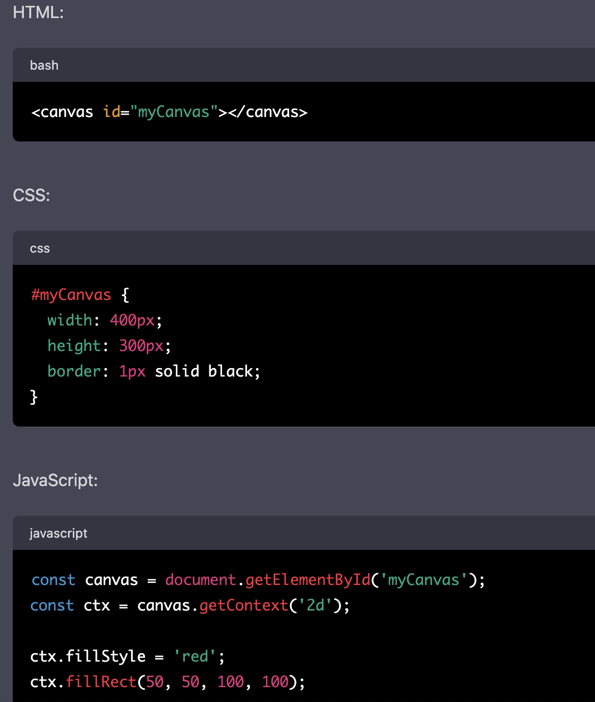
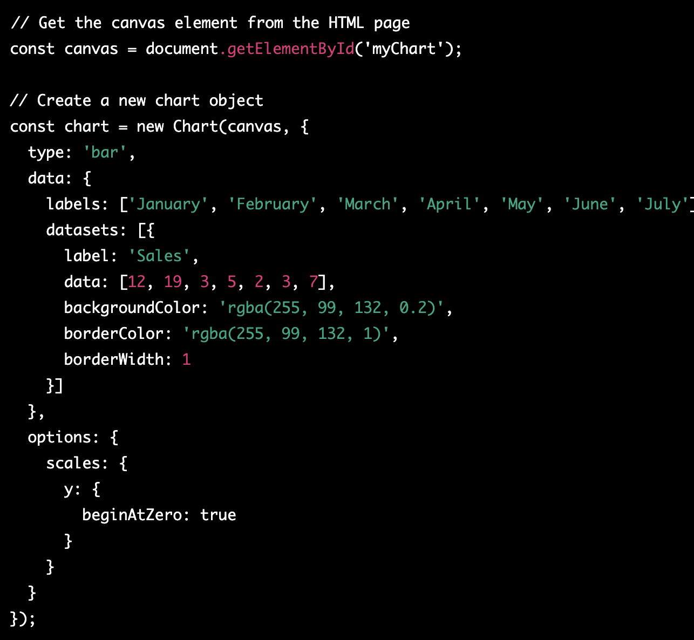

# HTML

## Canvas

## What is Canvas?

The HTML Canvas element is used to draw graphics on a web page.
The canvas element is a container that you can use to draw various shapes such as rectangles, circles, and lines.
To draw on the canvas element, you use the 2D context object which has various methods for drawing different shapes and paths.

## Functions for Canvas

- The fillStyle property is used to set the fill color for shapes, and the strokeStyle property is used to set the outline color.

`rect()`: This function is used to draw a rectangle on the canvas. It takes four arguments: x, y, width, and height, which define the position and size of the rectangle.

`arc()`: This function is used to draw an arc or a portion of a circle on the canvas. It takes six arguments: x, y, radius, startAngle, endAngle, and anticlockwise. The x and y arguments specify the center of the circle, the radius argument specifies the radius of the circle, and the startAngle and endAngle arguments specify the start and end angles of the arc in radians. The anticlockwise argument is optional and specifies whether the arc should be drawn in the opposite direction (counter-clockwise) from the default direction (clockwise).

`lineTo()`: This function is used to draw a line from the current point to a specified point on the canvas. It takes two arguments: x and y, which specify the endpoint of the line.

`fill()`: This function is used to fill the current path (a series of connected lines and curves) with a color or a pattern. It takes no arguments, and uses the current fill style (set using the fillStyle property) to fill the path.

- `clearRect()` to clear a rectangular area of the canvas

- `beginPath()` and `closePath()` to start and end a path that can be used to draw complex shapes.

- `drawImage()` method to draw an image on the canvas element

- `getImageData()` and `putImageData()` methods to manipulate the pixel data of the canvas.

## Example:

This will create a canvas with a black border, then draw a red rectangle on it with a width and height of 100 pixels, starting at position (50, 50) on the canvas.

## GetContext

Imagine that you have a big piece of paper, and you want to paint on it. But to start painting, you need a paintbrush. The getContext() method is like your paintbrush. It helps you get started with painting on the paper.

In web development, the getContext() method is used to get a reference to a drawing context on an HTML canvas element. It's like asking for permission to paint on the canvas. Once you get the context, you can use it to draw shapes, lines, text, and images on the canvas.

So, in simple terms, the getContext() method is like a tool that lets you paint on a canvas element in your web page.

# JavaScript

## Chart.js

Chart.js is a JavaScript library that allows you to create beautiful and responsive charts and graphs for your web applications.

Some key features of Chart.js include:

Support for multiple chart types, including line, bar, radar, doughnut, and more.
Customizable options for each chart type, including colors, labels, legends, and more.
Responsive design that automatically scales charts to fit different screen sizes.
Interactivity, including hover effects and click events, that allow users to explore and interact with the data.
Easy integration with other web technologies, including HTML, CSS, and JavaScript frameworks like React and Vue.

This code creates a new bar chart on a canvas element with the ID "myChart". The chart shows sales data for different months, and has a pink color scheme. The options object includes settings for the y-axis scale, which begins at zero to make it easier to compare data points.

## Different chart types you can create using Chart.js

Line chart: This chart is useful for showing trends over time. It displays data points connected by a straight line.

Bar chart: This chart is useful for comparing values across different categories. It displays rectangular bars with lengths proportional to the values they represent.

Pie chart: This chart is useful for showing proportions of a whole. It displays a circle divided into slices, with each slice representing a percentage of the total.

## chart Vs table format:

Improved visualization: Charts can display data in a visually appealing way that makes it easier for people to understand and interpret the data. Charts can use colors, shapes, and other elements to highlight key information and patterns in the data.

Ease of comparison: Charts make it easier to compare data values than tables. For example, a bar chart can display multiple data points side by side, making it easier to compare the values of each data point.

Clarity of trends: Charts can help identify trends and patterns in the data. For example, a line chart can display the change in data values over time, making it easier to identify trends and patterns in the data.

Simplification of complex data: Charts can help simplify complex data. For example, a pie chart can display the percentage of a total for each data point, making it easier to understand the relative sizes of each data point.

Faster comprehension: Charts can help people comprehend data more quickly than tables. Our brains are wired to process visual information faster than textual information, so charts can help people understand the data more quickly and easily.

How could Chart.js aid your previously created applications visually?

If you have previously created applications that display data in tables or simple text formats, you can use Chart.js to enhance the visual representation of the data in your application. By using Chart.js to create charts and graphs, you can make the data more visually appealing and easier to understand.

For example, if you have an application that displays sales data in a table, you can use Chart.js to create a bar chart or line chart that displays the same data. This will make it easier for users to compare sales data over time or across different product lines.

If your application displays data that has geographic relevance, you can use Chart.js to create a map chart that displays the data on a map. This can help users understand how the data varies geographically and identify trends or patterns.

In addition, Chart.js allows you to add interactivity to your charts. Users can hover over data points to see more information or click on data points to drill down into the data. This can enhance the user experience of your application and make it more engaging.

Overall, by using Chart.js to create charts and graphs, you can improve the visual representation of data in your application, make it easier to understand and compare data, and enhance the overall user experience of your application.