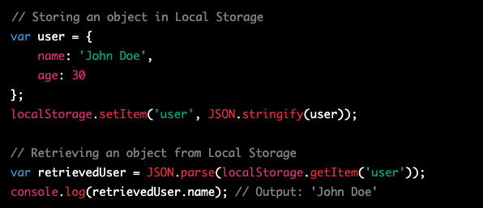

# Local Storage 

- Local Storage is a part of Web Storage API, enabling web applications to store data persistently in a user's browser.

- Better performance and less server interaction compared to cookies.

- Data is stored as key-value pairs.

- Mainly intended for small amounts of data (5-10 MB depending on the browser).

### Browser Support

- Supported by modern browsers, including Chrome, Firefox, Safari, Opera, and Internet Explorer 8+.

### Using Local Storage

- Access the localStorage object using window.localStorage or simply localStorage.

## Basic operations:

- Set an item: localStorage.setItem('key', 'value').

- Get an item: localStorage.getItem('key').

- Remove an item: localStorage.removeItem('key').

- Clear all items: localStorage.clear().

## Event:

The storage event is fired when a change is made to the storage area.
Example of handling a storage event:

The above example demonstrates how to listen for a storage event, and will output the following information:

- Key: 'username'

- Old Value: 'John Doe'

- New Value: 'Jane Doe'

URL: The URL of the page where the change occurred

## Limitations

- Local Storage is synchronous and can block the main thread, causing performance issues in large applications.

- Stored data is not encrypted and can be easily accessed, making it unsuitable for sensitive information.

- Limited storage capacity (5-10 MB depending on the browser).

- Data is stored per origin (per domain and protocol), so it cannot be shared across different domains or protocols.

## Alternatives

- IndexedDB: A more powerful and flexible storage solution for web applications, allowing storage of complex data types and transactions.

- WebSQL: A deprecated storage method that used SQL to interact with a local database. Not recommended for new projects.

- Cookies: Smaller in size and can be sent with every HTTP request, but can have performance issues and privacy concerns.

## Use Cases

- Storing user preferences, like theme or language settings.

- Saving game states or progress in web-based games.

- Implementing a "recently viewed" items list on an e-commerce website.

- Caching data for offline use or reducing server requests.

## Security Considerations

- Since Local Storage data is stored unencrypted, it is vulnerable to Cross-Site Scripting (XSS) attacks.

- To minimize risks, avoid storing sensitive information, such as passwords or personally identifiable information (PII).

- Sanitize and validate user input before storing it in Local Storage to prevent potential security vulnerabilities.

## JSON and Local Storage

- Local Storage only supports string values. To store complex data types, like objects or arrays, use JSON to convert the data before storing and retrieving it.

- Example:

## Session Storage

- Similar to Local Storage, Session Storage is another part of the Web Storage API.

- The main difference is that Session Storage data is only available for the duration of the page session (until the browser is closed or the tab is closed).

- Useful for storing temporary data, like form input values, that do not need to persist across browser sessions.

- Session Storage API methods are the same as those for Local Storage:

- Set an item: `sessionStorage.setItem('key', 'value')`.

- Get an item: `sessionStorage.getItem('key')`.

- Remove an item: `sessionStorage.removeItem('key')`.

- Clear all items: `sessionStorage.clear()`.

## Why would a developer use local storage for a web application?

- Improved performance: By storing data locally in the user's browser, the need for server requests is reduced. This can lead to faster load times and a more responsive application.

- Offline access: Local Storage allows web applications to cache data for offline use. Users can continue to interact with the application even when they are disconnected from the internet.

- Persisting user preferences: Local Storage can be used to store user preferences, such as theme or language settings, providing a personalized experience across different sessions.

- Reduced server load: By offloading some data storage tasks to the client side, server load can be minimized. This can save resources and lower hosting costs.

- State management: Local Storage can be used to save application states, such as the contents of a shopping cart or the progress in a game, so users can resume their activities where they left off.

- Form data retention: Storing form input values in Local Storage can help prevent data loss if the user accidentally refreshes or navigates away from the page. The form data can be restored when the user returns to the page.

- Caching resources: Local Storage can be used to cache frequently used resources, such as images, scripts, or stylesheets, improving the application's performance.

