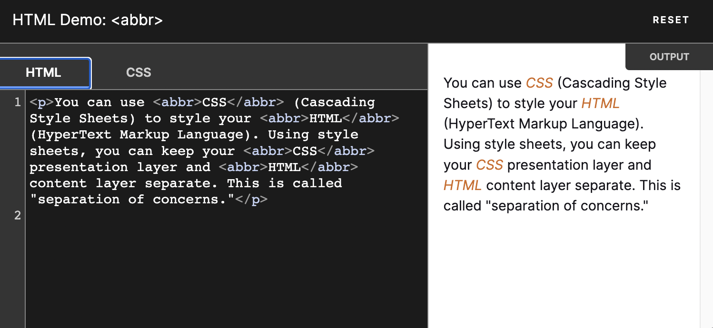
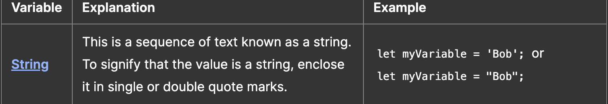
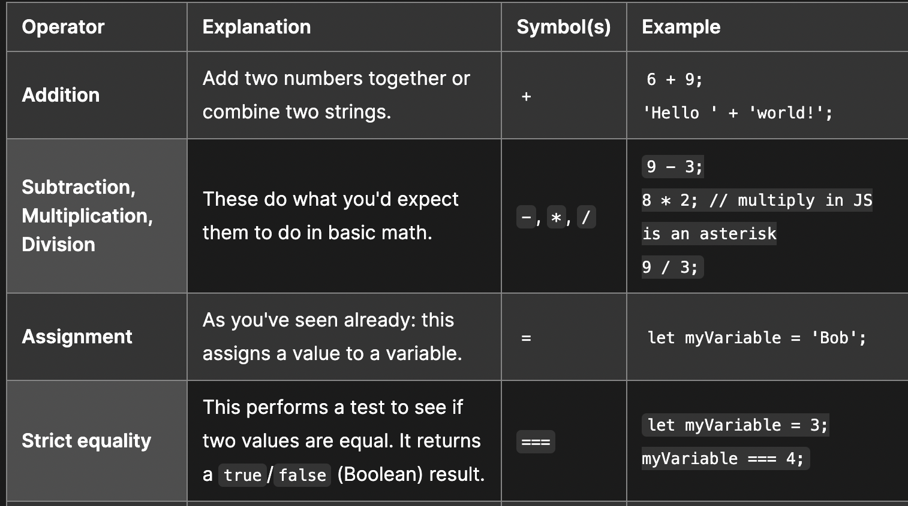
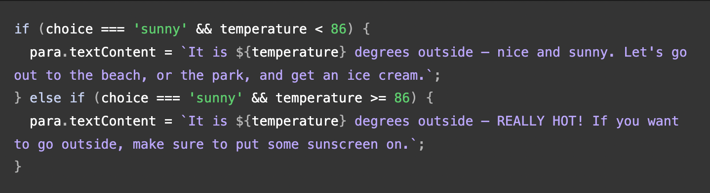

# Class 2

## Intro To HTML

### Why is it important to use semantic elements in our HTML?

One of HTML's main jobs is to give text meaning (also known as semantics), so that the browser knows how to display it correctly. Semantic help to break up a blocks of text into a structure of headings and paragraphs, add emphasis/importance to words, create lists, and more.

### Levels of Headings

There are six heading elements: `<h1>, <h2>, <h3>, <h4>, <h5>, and <h6>`. Each element represents a different level of content in the document; `<h1>` represents the main heading,`<h2>` represents subheadings, `<h3>` represents sub-subheadings, and so on.

### Sup VS. Sub

You will occasionally need to use superscript and subscript when marking up items like dates, chemical formulae, and mathematical equations so they have the correct meaning.

Sup(Superscript) - put text or numbers above the word or number that comes before

Sub(Subscript) - put text or numbers below the word or number that comes before

Example:

Code:

`
My birthday is on the 25th of May 2001.
`
`
`
  `Caffeine's chemical formula is`
 `C8H10N4O2.`
`
`
`
If x2 is 9, x must equal 3 or -3.
`

Results:

My birthday is on the 25th of May 2001.

  Caffeine's chemical formula is
  C8H10N4O2.

If x2 is 9, x must equal 3 or -3.

### Abbr HTML Tag

The `<abbr>` HTML element represents an abbreviation or acronym.

When including an abbreviation or acronym, provide a full expansion of the term in plain text on first use, along with the `<abbr>` to mark up the abbreviation. This informs the user what the abbreviation or acronym means.

Example :

Each `<abbr>` element you use is independent of all others; providing a title for one does not automatically attach the same expansion text to others with the same content text.

- When an abbreviation is used and you want to provide an expansion or definition outside the flow of the document's content, use `<abbr>` with an appropriate title.

- To define an abbreviation which may be unfamiliar to the reader, present the term using `<abbr>`and inline text providing the definition. Include a title attribute only when the inline expansion or definition is not available.

- When an abbreviation's presence in the text needs to be semantically noted, the `<abbr>` element is useful. This can be used, in turn, for styling or scripting purposes.

- You can use `<abbr>` in concert with `<dfn>` to establish definitions for terms which are abbreviations or acronyms. See the example Defining an abbreviation below.

Syntax: 

`
The <abbr title="World Health Organization">WHO</abbr> is a specialized agency of the United Nations.
`

## CSS 

### Ways we can apply CSS to our HTML

External stylesheet - contains CSS in a separate file with a `.css` extension. This is the most common and useful method of bringing CSS to a document. You can link a single CSS file to multiple web pages, styling all of them with the same CSS stylesheet.

Internal stylesheet - An internal stylesheet resides within an HTML document. To create an internal stylesheet, you place CSS inside a `<style>` element contained inside the HTML `<head>`.

Inline styles - Inline styles are CSS declarations that affect a single HTML element, contained within a style attribute. The implementation of an inline style in an HTML document might look like this:

 `<h1 style="color: blue;background-color: yellow;border: 1px solid black;">`
 
      Hello World!

   `</h1>`
  
   `
This is my first CSS example
`

- **Avoid** using CSS in inline style, when possible. It is the opposite of a best practice. First, it is the least efficient implementation of CSS for maintenance. One styling change might require multiple edits within a single web page. Second, inline CSS also mixes (CSS) presentational code with HTML and content, making everything more difficult to read and understand. Separating code and content makes maintenance easier for all who work on the website.

### Struture of CSS

Each CSS rule starts with a selector — or a list of selectors — in order to tell the browser which element or elements the rules should apply to. 

Properties - are human-readable identifiers that indicate which stylistic features you want to modify.

When a property is paired with a value, this pairing is called a CSS declaration.

 `h2(Selector) {`

`color(property): black(value);`

`padding(property): 5px(value);`

(everything inbetween the curly braces are declarations)

   `}`

## JavaScript

### What data type is a sequence of text enclosed in single quote marks?

### 4 types of JavaScript operators

### Real world Problem

One real-world problem that can be solved with a function is calculating the total cost of an order in an online shopping cart.

## Conditionals

An if statement checks a condition and if it evaluates to true or false, then the code block will execute.

## Else if

There is a way to chain on extra choices/outcomes to your if...else — using else if. Each extra choice requires an additional block to put in between if () { } and else { }

## List 3 different types of comparison operators

Comparison operators are used to test the conditions inside our conditional statements.

- === and !== — test if one value is identical to, or not identical to, another.

- < and > — test if one value is less than or greater than another.

- <= and >= — test if one value is less than or equal to, or greater than or equal to, another.

## Difference between the logical operator && and ||

If you want to test multiple conditions without writing nested if...else statements, logical operators can help you. When used in conditions, the first two do the following:

- `&&` — AND; allows you to chain together two or more expressions so that all of them have to individually evaluate to true for the whole expression to return true.

- `||` — OR; allows you to chain together two or more expressions so that one or more of them have to individually evaluate to true for the whole expression to return true.

Example:

## Thing I want to Learn:

Event listeners is something I want to experiment with

Switch statments

Ternary operators
