# HTML

## Unodered List

The `<ul>` HTML element represents an unordered list of items, typically rendered as a bulleted list.

The `<ul>`element is for grouping a collection of items that do not have a numerical ordering, and their order in the list is meaningless.

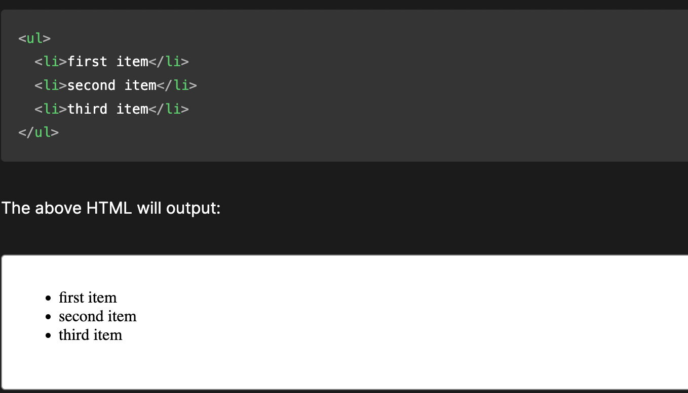

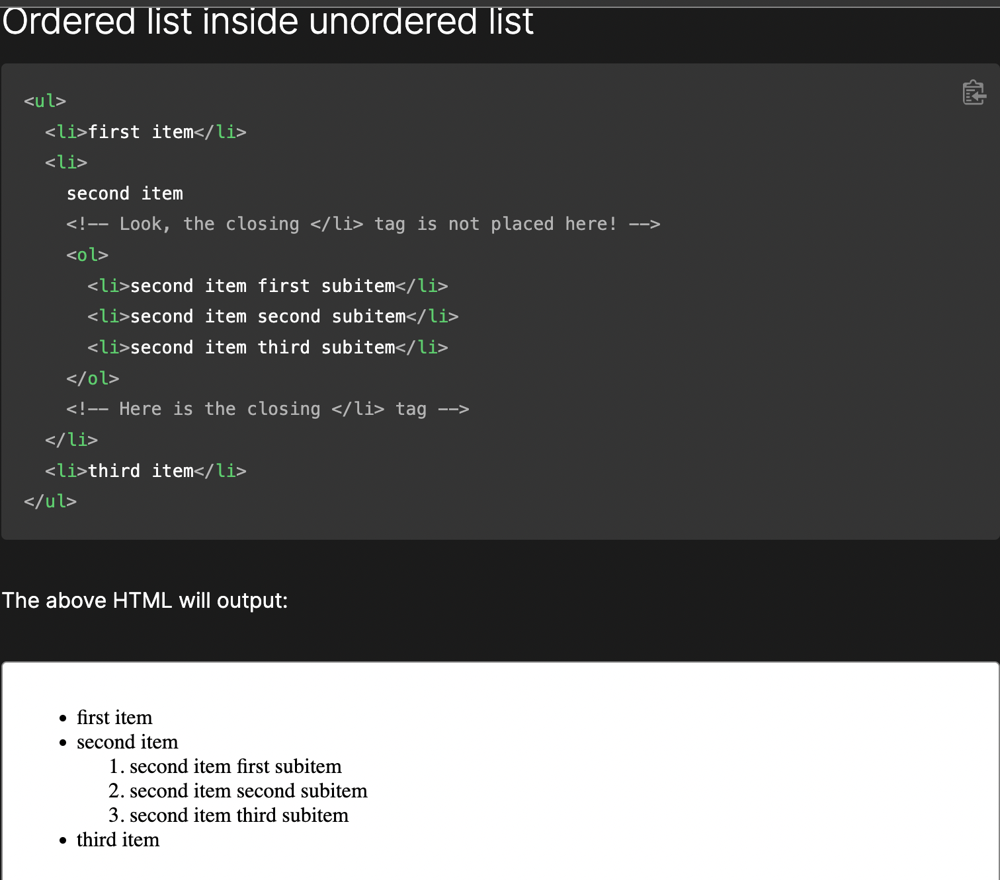

## Bullet Style

The list-style-type CSS property sets the marker (such as a disc, character, or custom counter style) of a list item element.

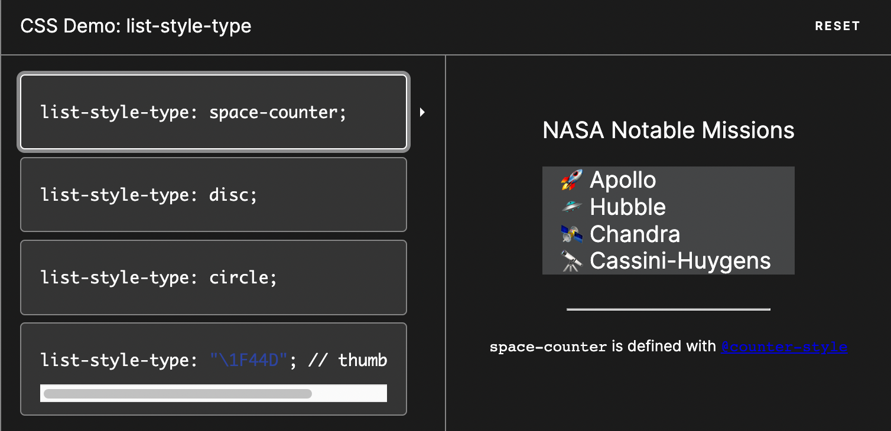

## Order Vs Unordered

Ordered List render in numerical order and an unordered list of items, typically render as a bulleted list.

## Ways to change the numbers on list items provided by an ordered list

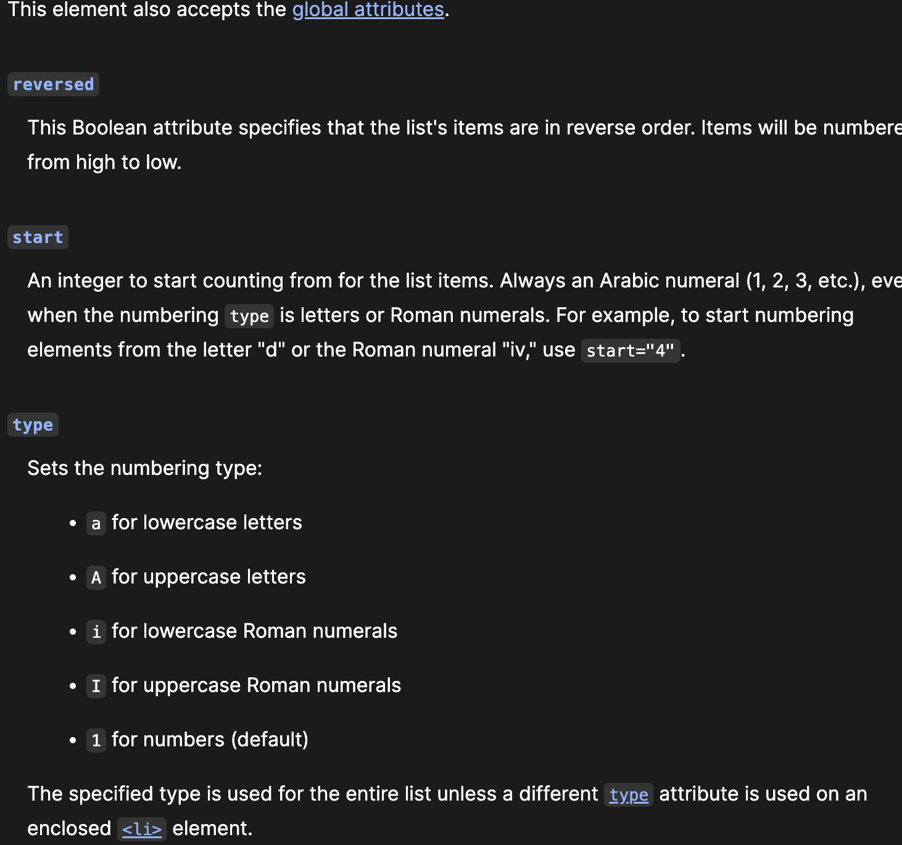

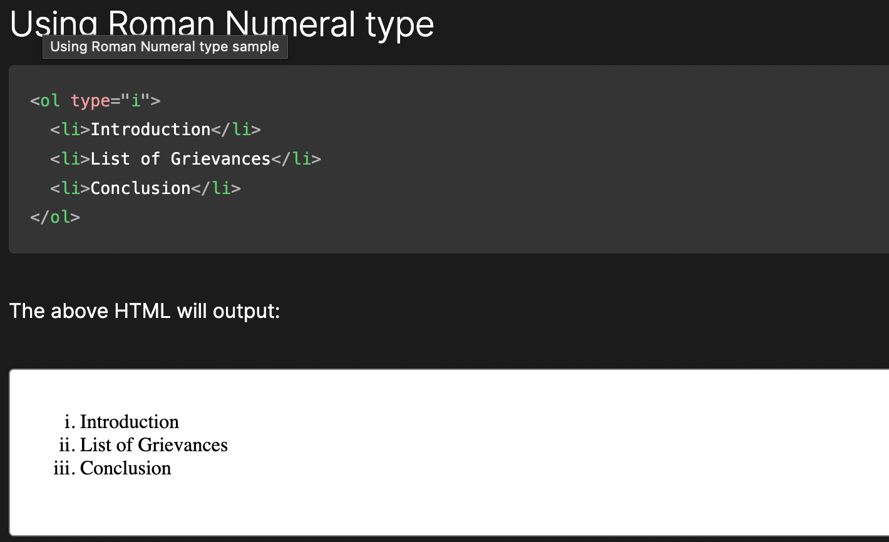

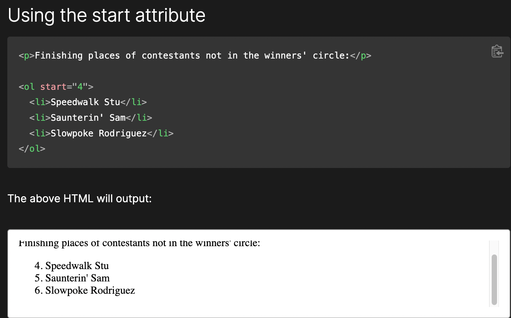

# CSS

## Margin and Padding

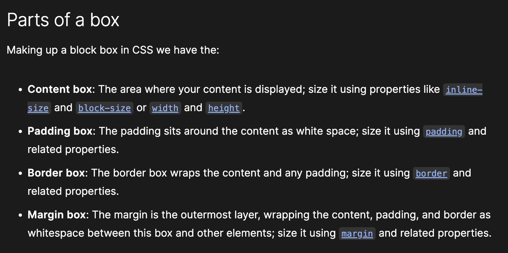

## Box model

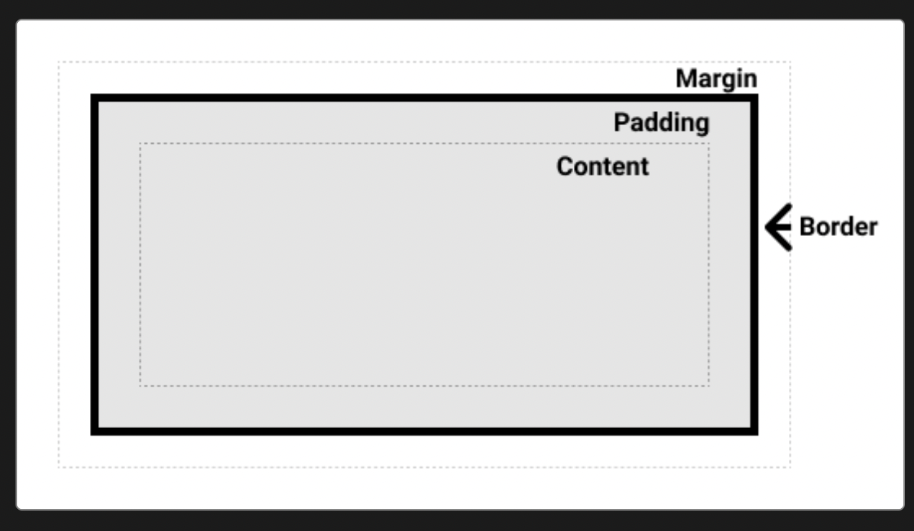

## The Box Model Story

Once upon a time in a world of web design, there lived two characters named Margin and Padding.

Margin was a bit of an aloof character, `always maintaining some distance from other elements on the page.` He was a transparent fellow, letting his surroundings show through, and he valued personal space. Margin was often seen hanging out on the edges of the page, creating a buffer zone between himself and other elements.

On the other hand, Padding was much more welcoming and approachable. He was a soft, friendly character that filled the inside of boxes, creating a warm and inviting space. Padding loved to make things comfortable for other elements on the page, providing a soft cushion for them to rest on.

Together, Margin and `Padding played crucial roles in "The Box Model." Their job was to define the space between and within boxes on a web page.` Margin would create space between the box and other elements on the page, while Padding would create space within the box itself.

Their cooperation was vital to maintaining order and structure in the story. Without them, boxes on the page would be jumbled and disorganized, with no clear sense of space or hierarchy.

In conclusion, Margin and Padding were the unsung heroes of "The Box Model." Their roles may seem small, but they were vital to the overall design and functionality of web pages. Without them, the story of web design would be incomplete.

# JavaScript

## Data types can you store inside of an Array

### What is an Array

Arrays are generally described as "list-like objects"; they are basically single objects that contain multiple values stored in a list.

### All about Arrays

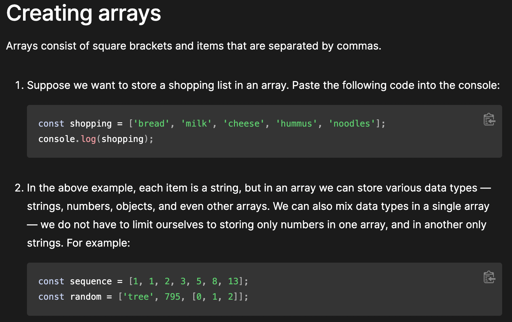
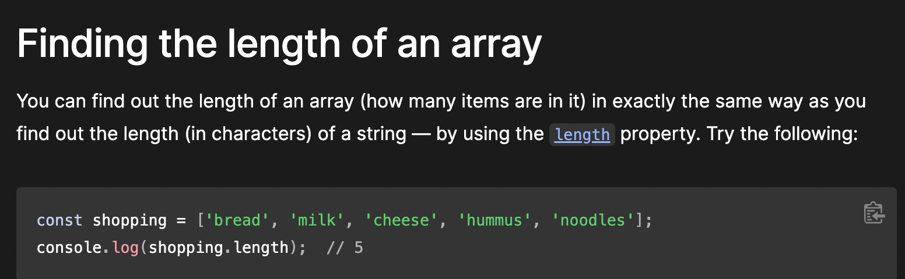

## People array

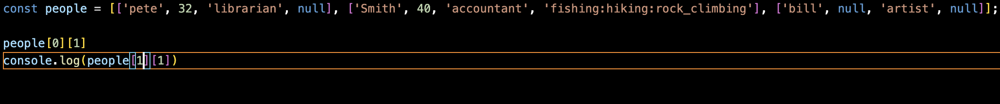

In the example above you can access the arrays by console.log the array with it's own index number then accessing the index number within that array.

## Five shorthand operators

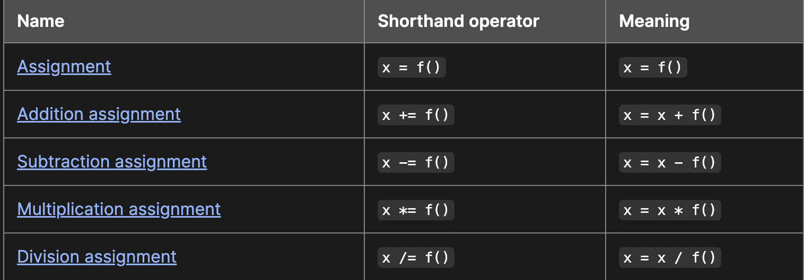

## last expression

True has a value of 1 and false has a value of 0
so when you add the values together it results to 10dog

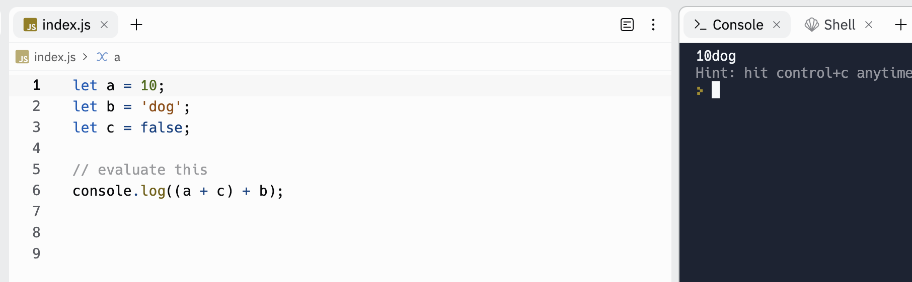

## Real world example of when a conditional statement

One real world example of when a conditional statement is used is in weather forecasting.

Weather forecasts are based on analyzing data from multiple sources such as weather satellites, radar, and ground observations.

## When a Loop is useful in JavaScript

A loop is useful in JavaScript when you need to perform a repetitive task or iterate over a collection of items in your code.
