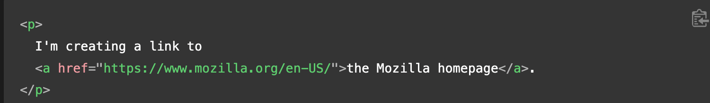

# HTML

To create a basic link, we wrap text or other content inside an Anchor tag

See example below:

## Href

Href(Hypertext Reference) contains the web address.

## Accessibility

Title - contains additional information about the link, such as which kind of information the page contains, or things to be aware of on the website

A link `title` is only revealed on mouse hover, which means that people relying on keyboard controls or touchscreens to navigate web pages will have difficulty accessing `title` information. If a `title's` information is truly important to the usability of the page, then you should present it in a manner that will be accessible to all users, for example by putting it in the regular text.

# CSS

Normal flow - the way that webpage elements lay themselves out if you haven't changed their layout or the default layout for CSS elements.

Flex Box - is a one-dimensional layout method for arranging items in rows or columns. Items flex (expand) to fill additional space or shrink to fit into smaller spaces

The following simple layout designs are either difficult or impossible to achieve with such tools in any kind of convenient, flexible way:

- Vertically centering a block of content inside its parent.

- Making all the children of a container take up an equal amount of the available width/height, regardless of how much width/height is available.

- Making all columns in a multiple-column layout adopt the same height even if they contain a different amount of content.

## Block-level Vs. Inline

Block-level elements - occupies the entire horizontal space of its parent element (container), and vertical space equal to the height of its contents, thereby creating a "block".

### Differences

Block-level elements are elements that have functionality on their own and typical they have content inbetween them. An example would be a p tag.

Content model

- Generally, block-level elements may contain inline elements and (sometimes) other block-level elements. Inherent in this structural distinction is the idea that block elements create "larger" structures than inline elements.

Default formatting

- By default, block-level elements begin on new lines, but inline elements can start anywhere in a line.

Inline-level - elements which only occupy the space bounded by the tags defining the element, instead of breaking the flow of the content

Example:

## Positioning

Static positioning is the default that every element gets

### Advantages of Absolute Positioning

An absolutely positioned element no longer exists in the normal document flow. Instead, it sits on its own layer separate from everything else. This is very useful: it means that we can create isolated UI features that don't interfere with the layout of other elements on the page. For example, popup information boxes, control menus, rollover panels, UI features that can be dragged and dropped anywhere on the page, and so on.

Top, bottom, left, and right behave in a different way with absolute positioning.Rather than positioning the element based on its relative position within the normal document flow, they specify the distance the element should be from each of the containing element's sides.

## Fixed Vs. Absolute

Whereas `absolute positioning` fixes an element in place relative to its nearest positioned ancestor (the initial containing block if there isn't one), `fixed positioning` usually fixes an element in place relative to the visible portion of the viewport. (An exception to this occurs if one of the element's ancestors is a fixed containing block because its transform property has a value other than none. This means that you can create useful UI items that are fixed in place, like persistent navigation menus that are always visible no matter how much the page scrolls.

# JavaScript

Function declaration - declares the name of the function along with the function's intructions(code)

Function Invocation - this calls the function by typing `function_name()`. When ever this is typed either in your JS or HTML file, the code inside the function will run

Parameters - these are values that need to be included inside the function parentheses, which it needs to do its job properly.

Aruguments - values that are passed to the function and assigned to the parameters 

In JavaScript, a parameter is a variable that is defined in the function signature and used to receive data from the caller when the function is called. An argument, on the other hand, is the actual value or reference that is passed to the function when it is called.

To better understand the difference between parameters and arguments, consider the following example:

In the above code, num1 and num2 are the parameters of the addNumbers function. When the function is called with the arguments `5 and 7`, these values are passed to the function and assigned to the parameters `num1 and num2`. The function then adds the two numbers and returns the result, which is stored in the result variable.

In summary, parameters are variables defined in the function signature, while arguments are the actual values or references passed to the function when it is called.

## What is Pair Promgramming

Pair programming commonly involves two roles: the Driver and the Navigator

The Driver is the programmer who is typing and the only one whose hands are on the keyboard. Handling the “mechanics” of coding, the Driver manages the text editor, switching files, version control, and—of course writing—code.

The Navigator uses their words to guide the Driver but does not provide any direct input to the computer.

Four fundamental skills that help anyone learn a new language:

- Listening: hearing and interpreting the vocabulary

- Speaking: using the correct words to communicate an idea

- Reading: understanding what written language intends to convey

- Writing: producing from scratch a meaningful, well structured solution

## 2 benefits to pair programming

Learning from fellow students

- I feel like learning from other students have taaught me a lot in the past 3 weeks on all types of code. This benefit has also allowed me to be able to teach others what I have been taught. So for instance in the pass coding lab, a fellow classmate taught me how to give the user a score on the quiz we made and I was then able to walk others on how to do the same.

Engaged collaboration

- I feel like engaged collaboration is inevitable when working on code and bonus points if the other programmer is just as interested in coding as you are. I have already experienced a sense of engaged collabortion in the past 3 weeks. When we were doing some Git command assignments some of my classmates and I worked on of the assignments together. We eventually ended up walking through it together and putting the same answers in and seeing what worked.

