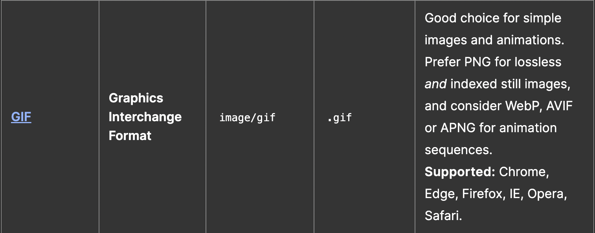
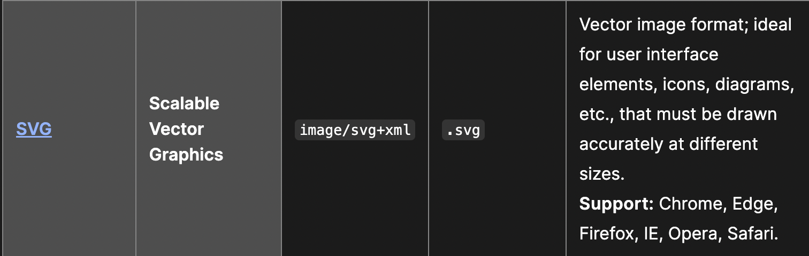

# HTML

alt - this attribute is used to make a short description of an image.

Accessiblity can be improved by adding a alt and title attribute.
These attributes should be used to add a short description of what is there or where a link takes you.

The `<figure>` HTML element represents self-contained content, potentially with an optional caption, which is specified using the `<figcaption>`element. The figure, its caption, and its contents are referenced as a single unit.

Usually a `<figure>` is an image, illustration, diagram, code snippet, etc., that is referenced in the main flow of a document, but that can be moved to another part of the document or to an appendix without affecting the main flow.

## difference between a gif image and an svg image

## What image type would you use to display a screenshot on your website and why?

The best image type to use for displaying a screenshot on a website is a PNG. PNG images offer a good level of image quality and relatively small file size, making them ideal for websites. They also support transparency, which is helpful for displaying screenshots with a transparent background.

## Foreground Vs Background

Foreground colors are the colors used to display text and other elements in the foreground of an HTML element. Background colors are the colors used to display the background of an HTML element, typically behind the text and other elements. In other words, foreground colors are what you see when you look at a web page, while background colors are what's behind the text and other elements on the page.

## Helping a Friend

1. Choose a strategically placed primary color to act as an accent and draw attention to key areas. 

2. Use subtle offshoots of the primary color to provide visual interest and break up the monotony of the page.

3. Incorporate a secondary color to add balance and contrast to the page. 

4. Use bold colors sparingly to highlight important sections and draw the reader's eye.

5. Play with color gradients to provide a unique and dynamic feel.

6. Consider introducing color-coded categories to organize content and make navigation easier.

## Considerations

1. Readability: Choose fonts that are easy to read for the intended audience.

2. Compatibility: Make sure the fonts you choose are compatible with all major browsers.

3. Contrast: Make sure the font color contrasts well with the background color.

4. Size: Choose a font size that is appropriate for the content.

5. Legibility: Choose a font that is legible across different devices.

6. Weight: Consider the font weight of the font as it can affect the readability. Font weight controls the thickness of the text

7. Accessibility: Choose fonts that are accessible to people with disabilities.

## What do font-size, font-weight, and font-style do to HTML text elements?

- Font-size determines the size of the text

- Font-weight determines the boldness of the text

- Font-style determines whether the text is italicized or not.

## Two ways you could add spacing around the characters displayed in an h1 element

1. Use the margin or padding property in CSS on the h1 element to create a desired amount of space around the element.

2. Use the :before and :after pseudo-elements in CSS to add a desired amount of space around the h1 element.
