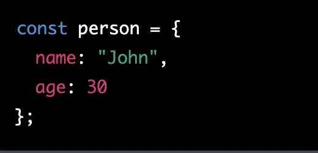
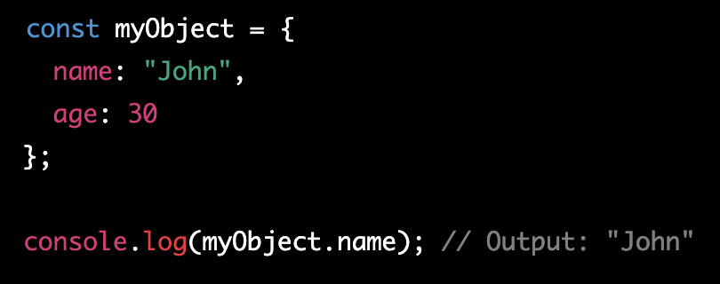
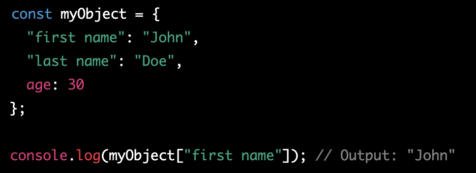
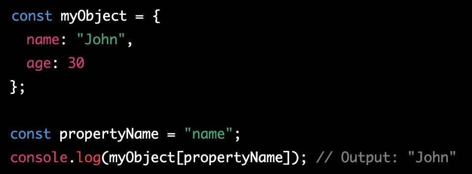

# Javascript

## Objects

An object in JavaScript is like a container that can hold different pieces of information, just like a backpack that can hold your books, phone, and other belongings.

Inside an object, you can store things like numbers, text, lists, and even other objects! Each piece of information inside an object has a name, which we call a "property".

For example, imagine we have an object called "person". This person object might have properties like "name", "age", and "hobbies". The "name" property might store a text value like "John", the "age" property might store a number like 25, and the "hobbies" property might store a list of text values like ["reading", "swimming", "playing guitar"].

By using objects in JavaScript, we can organize and manage different types of data in a more efficient and logical way.

## Key-value Pairs

key-value pairs are a way to organize and store data. Imagine you have a box with lots of compartments, and each compartment has a label. The label tells you what is inside that compartment. That's a bit like a key-value pair.

In JavaScript, key-value pairs work in a similar way. They are used to store data in a structured way. The "key" is like the label on a compartment, and the "value" is like the thing inside the compartment.

For example, let's say you have a program that stores information about a person, such as their name and age. You could use a key-value pair to store this information. The "key" would be the type of information, like "name" or "age", and the "value" would be the actual data, like "John" or 30.

Here's an example of what a key-value pair might look like in JavaScript:

In this example, the "name" key has a value of "John", and the "age" key has a value of 30. By using key-value pairs, we can store and organize data in a way that is easy to read and access.

## What are some advantages to creating object literals?

Object literals are a type of object in JavaScript that are created using curly braces {} and are initialized with one or more key-value pairs. Here are some advantages of using object literals:

1. Simplicity: Object literals are simple and easy to create. They don't require a lot of syntax and can be created quickly.

2. Clarity: Object literals are easy to read and understand. The key-value pairs make it clear what data is being stored and what it represents.

3. Flexibility: Object literals can be modified and expanded easily. You can add or remove properties or values as needed, making them very flexible.

4. Speed: Object literals are fast to access and manipulate. Since they are stored in memory, accessing them is very quick and efficient.

5. Reusability: Object literals can be reused throughout your code. You can define an object literal once and use it in multiple places, reducing the amount of redundant code you need to write.

## Objects VS Arrays

Think of an object in JavaScript as a container that holds different pieces of information, like a box with different items inside. Each item inside the box is assigned a label, which helps us easily access and manipulate the item. These labels are called "keys" in JavaScript, and the items can be any type of value - like numbers, strings, or even other objects.

On the other hand, an array in JavaScript is like a list of items, similar to a grocery list. Each item in the list has an index number that tells us where it is located in the list. We can access and manipulate the items in the list by referring to their index numbers.

So, the main difference between objects and arrays in JavaScript is that `objects use keys to access their values, while arrays use index numbers.` Additionally, objects can hold any type of value, while arrays are typically used to hold lists of similar items (like a list of numbers or a list of names).

## Bracet VS Dot notation

In JavaScript, there are two main ways to access an object's property: using bracket notation and using dot notation.

The key difference between these two notations is the way the property name is specified.

1. Dot notation:
This is the simpler of the two notations, and it's used by writing the object name, followed by a dot (.), and then the name of the property you want to access. For example:

2. Bracket notation:
This notation is used by enclosing the property name in square brackets ([]). This notation can be useful when the property name is not known in advance, or when the property name contains spaces or special characters. For example:

## Real Difference

One key thing to note is that when using bracket notation, the property name must be enclosed in quotes (either single or double quotes), whereas in dot notation, the property name is not quoted. Additionally, bracket notation can also be used with variables to dynamically access object properties. For example:

In summary, both notations allow you to access an object's property, but they differ in the way you specify the property name. Use dot notation when the property name is known in advance and doesn't contain spaces or special characters, and use bracket notation when the property name is not known in advance or contains spaces or special characters.

## What does the term this refer to and what is the advantage to using this?

The keyword `"this"` refers to the object that the function is a method of. It allows the function to access and manipulate the properties of the object that it is attached to.

The advantage of using `"this"` is that it allows for more flexible and reusable code. By using `"this"`, you can write a function once and use it with multiple objects, rather than writing a separate function for each object. This can make your code more concise and easier to maintain. Additionally, `"this"` allows for dynamic binding, meaning that the object that `"this"` refers to can change depending on how the function is called, allowing for greater flexibility and functionality in your code.

## What is the DOM?

So, imagine you have a web page open in your browser. This web page is made up of lots of different elements, like headings, paragraphs, images, and buttons. The DOM is like a map or a blueprint that shows how all of these elements are organized and related to each other.

Think of the DOM as a kind of tree structure, where each element on the page is like a branch. The main branch is the document itself, and each element on the page is a sub-branch that extends from it. This tree structure is important because it allows developers to access and manipulate individual elements on the page.

So, let's say you wanted to change the text of a button on a web page. Using the DOM, you could find that button element in the tree structure and update its text to say whatever you wanted.

In short, the DOM is like a blueprint that developers use to access and manipulate elements on a web page. It helps them understand how all of the different pieces fit together and allows them to make changes to the page as needed.

## Relationship between DOM and JavaScript

Imagine that you have a big box that contains a bunch of different objects, and you want to be able to interact with those objects in different ways. The box is like the Document Object Model (DOM), which is a representation of the web page that your browser creates so that JavaScript can interact with it.

JavaScript is like a set of instructions that you can use to interact with the objects in the box. For example, you can use JavaScript to find a specific object in the box (like a particular toy), change its color or size, or move it to a different location in the box. Similarly, you can use JavaScript to interact with the different elements on a web page, like changing the text or color of a button, or adding new elements to the page.

So in a nutshell, JavaScript and the DOM work together to allow developers to create interactive and dynamic web pages by giving them the ability to manipulate the elements on the page.

## Math.random()

Math.Random give you a range in between 0 through 1

