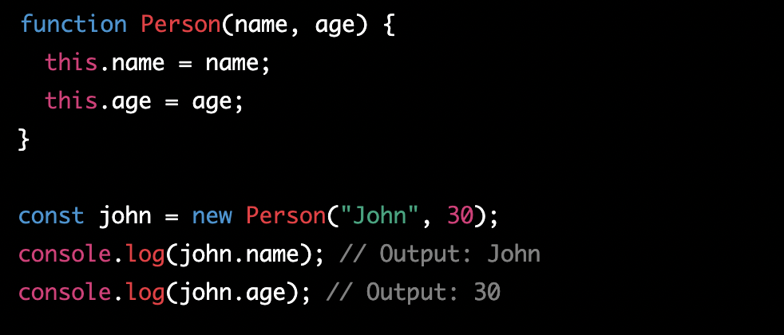
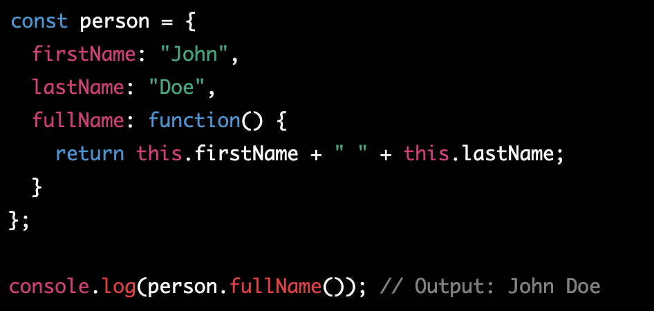
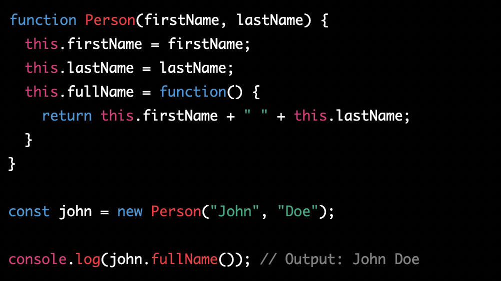
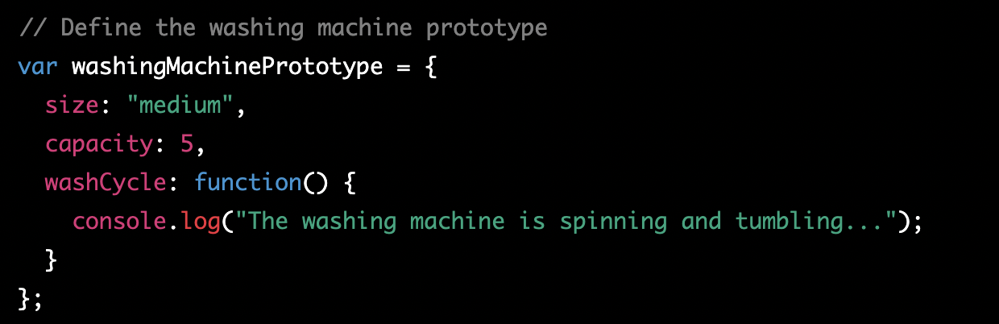
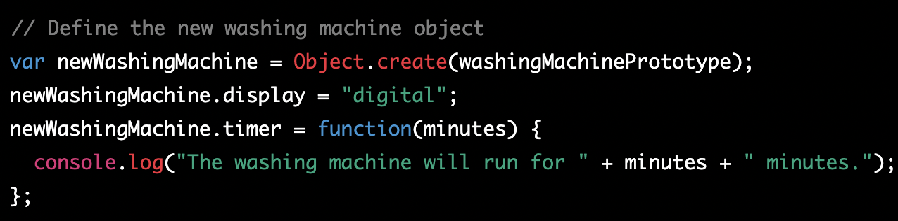

# What is Domain Modeling

So, imagine you have a really cool toy with lots of different parts and pieces. You love playing with it, but sometimes it can get a bit confusing because there are so many different parts and you don't know how they all work together.

Domain modeling is kind of like taking that toy apart and laying out all the pieces in an organized way so that you can see how they all fit together. It helps you understand the different parts and how they work together to make the toy do what it does.

In the same way, domain modeling is a process of breaking down a complex concept or idea into smaller, more manageable parts. By doing this, we can better understand how all the pieces fit together and how they interact with each other. It helps us see the big picture and make sense of complex information.

For example, let's say we're talking about a business. There are a lot of different aspects to a business, like employees, customers, products, services, and finances. Domain modeling would help us break down each of these aspects and understand how they are all connected. This can help us make better decisions and run the business more efficiently.

So, in short, `domain modeling is like taking a big, complicated idea and breaking it down into smaller, more understandable parts`. It helps us understand how everything fits together and makes it easier to work with complex information.

## Why we need DM

Imagine you have a big pile of different colored Legos and you want to build a cool spaceship. But before you start building, you need to have a plan, right?

Domain modeling is kind of like making a plan for building your spaceship. You start by thinking about all the different parts you need, like the cockpit, the engines, the wings, and the landing gear. Then you figure out how all these parts fit together to make your spaceship.

In the same way, domain modeling is a way of planning out how different parts of a big idea or project fit together. It helps us understand what we need and how everything should work together. For example, let's say we're planning a big party. We need to think about things like the guest list, the food, the decorations, and the entertainment. Domain modeling would help us break down each of these parts and figure out how they all fit together to make a great party.

By using domain modeling, we can make sure we're not missing any important parts and that everything works together smoothly. It's like having a map that shows us where we're going and how to get there. So, whether you're building a spaceship or planning a party, domain modeling is a helpful tool that can make the process easier and more organized.

## Tables not be used for page layouts

Tables are often used to organize information, but they are not ideal for page layouts. Here are a few reasons why:

Limited Flexibility: Tables are designed to organize data into rows and columns, but they don't provide much flexibility in terms of layout. This means that it can be difficult to create complex designs using tables.

Accessibility: Tables can make it difficult for people with disabilities to access the content on a web page. For example, screen readers for people with visual impairments may not be able to interpret the information in a table, making it impossible for them to navigate the page.

Responsiveness: Tables can also cause issues with responsive design, which means designing a web page that looks good on different screen sizes. Tables can make it difficult to create a layout that adapts to different screen sizes, which can lead to a poor user experience.

Slower Load Time: Using tables for layout can also slow down the load time of a web page, especially if the table contains a lot of data. This can make the user experience frustrating and cause people to leave the site.

Instead of using tables for page layouts, web developers use other techniques like HTML and CSS to create flexible and accessible designs that look good on any device. These techniques allow developers to create layouts that adapt to different screen sizes and make it easy for people with disabilities to access the content on the page.

## 3 different semantic HTML elements used in an HTML `<table>`

Three different semantic HTML elements that are commonly used in an HTML `<table>`:

`<thead>`: This element is used to define the header section of a table, which typically contains column headings or titles. The `<thead>`element is usually placed before the `<tbody>` element and can include one or more rows of table headers.

`<tbody>`: This element is used to define the body section of a table, which contains the main content or data of the table. The `<tbody>` element should contain one or more `<tr>` elements, which define the individual rows of the table.

`<tfoot>`: This element is used to define the footer section of a table, which typically contains summary or totals rows for the table. The `<tfoot>` element is usually placed after the `<tbody>` element and can include one or more rows of table footers.

These semantic HTML elements are important because they help to structure the content of the table in a meaningful way. By using these elements, we can make it easier for screen readers and other assistive technologies to interpret the content of the table, which can improve the accessibility of our website. Additionally, using semantic HTML elements can also help to improve the search engine optimization (SEO) of our website, as search engines can better understand the structure and meaning of our content.

## What is an instructor and why is it important?

Imagine you're building a toy car using a construction kit. The kit contains all the pieces you need to build the car, and it also includes a set of instructions that tell you how to put the pieces together. A constructor in JavaScript is a lot like the instructions in that kit. It's a special function that helps you build objects by defining what they should look like and how they should work.

So, if you were building a toy car in JavaScript, you might use a constructor to define what the car should look like and how it should behave. You could specify that it should have four wheels, two doors, and a steering wheel, and that it should be able to move forward and backward. Then, when you create a new toy car object using that constructor, it would automatically have those characteristics.

One advantage of using a constructor in JavaScript is that it allows you to create multiple objects with the same characteristics without having to write the same code over and over again. For example, if you wanted to create a fleet of toy cars, you could use the same constructor to create each one, and they would all have the same properties and methods.

Another advantage is that constructors can be used to create more complex objects that have properties and methods that interact with each other. For example, you could create a constructor for a game character that has a health property and a method for attacking other characters. Then you could create multiple instances of that character, and they would all have their own health and attacking abilities.

Overall, a constructor in JavaScript is a useful tool for creating objects with predefined characteristics and behaviors. It can save you time and effort when creating multiple objects with similar properties, and it can help you build more complex objects that interact with each other in interesting ways.

## Understanding Constructors

Imagine that you are building a house with Lego blocks. Before you can start playing with the house, you need to first assemble the foundation, walls, and roof. The foundation is like the constructor in JavaScript.

A constructor in JavaScript is a special function that is used to create objects with specific properties and methods. It's like a blueprint for creating objects. When you call a constructor function with the "new" keyword, it creates a new object based on the blueprint defined in the constructor function.

Here's an example of a constructor function in JavaScript that creates a person object with a name and age property:

In this example, the Person constructor function takes two arguments: name and age. When the function is called with the "new" keyword, it creates a new object with the "name" and "age" properties set to the values passed in as arguments.

`One advantage of using constructors in JavaScript is that they allow you to create objects with the same properties and methods without having to repeat the same code over and over again.` For example, if you wanted to create multiple person objects, you could use the same Person constructor function to create them all.

`Another advantage of using constructors is that they allow you to encapsulate logic and data within an object.` This means that the code and data related to a particular object are kept together and can't be accessed or modified from outside the object unless you explicitly allow it.

So, to sum it up, a constructor in JavaScript is like a blueprint for creating objects with specific properties and methods. It allows you to create multiple objects with the same properties and methods without repeating the same code, and it also helps you encapsulate data and logic within an object.

## Key-word this 

In JavaScript, the meaning of the this keyword can vary depending on how it is used. When used inside an object literal, this refers to the object that contains it. When used inside a constructor function, this refers to the object being created by that constructor.

When used in an object literal, `this refers to the object that contains it.` For example:

In the above example, this refers to the person object.

`When used in a constructor function, this refers to the object being created by that constructor.` For example:

In the above example, this refers to the john object that is being created by the Person constructor.

## Prototypes

In this analogy, let's say that you are the owner of a coin laundry business, and you have a variety of washing machines and dryers. Each machine has different features and capabilities, and customers use them to do their laundry by inserting coins or tokens.

Now, let's say that each machine represents an object in a JavaScript program. Each machine has certain properties (such as its size, capacity, and cycle options) and certain behaviors (such as spinning and tumbling during a wash cycle).

Prototypes in JavaScript can be thought of as templates for these machines. Just as you might have a template for a washing machine that specifies its basic properties and behaviors, you can create a prototype in JavaScript that specifies the basic properties and behaviors of an object.

Here's an example of a simple washing machine prototype in JavaScript:

In this code, we define a `washingMachinePrototype`
object that specifies the basic properties and behaviors of a washing machine. This prototype includes three properties (size, capacity, and washCycle), which define the size and capacity of the machine, as well as the behavior it exhibits during a wash cycle.

Now, let's say that you have a newer washing machine model that has additional features, such as a digital display and a timer. You could create a new object that "inherits" from the washingMachinePrototype and adds these additional properties and behaviors.

Here's an example of a new washing machine object that inherits from the `washingMachinePrototype`:

In this code, we create a new object called newWashingMachine that inherits from the washingMachinePrototype. We use the Object.create() method to create a new object that has the washingMachinePrototype as its prototype.

We then add two additional properties to this object: display, which specifies that the machine has a digital display, and timer, which is a function that sets the length of the wash cycle based on the number of minutes passed in as an argument.

By using inheritance, we were able to create a new object that borrows the basic properties and behaviors of the washingMachinePrototype, but also adds in its own unique properties and behaviors.

So, in summary: prototypes in JavaScript are like templates for objects, while inheritance allows objects to borrow and extend the properties and behaviors of other objects. Just as you might have a variety of washing machines with different capabilities in your coin laundry business, a JavaScript program might have a variety of objects with different properties and behaviors, all built on top of prototypes and inheritance.

## Objects Literals & Prototypes

If a member of a object is a function it is refered to as a method.

When an object has 1 or more methods it is called a behavior.
