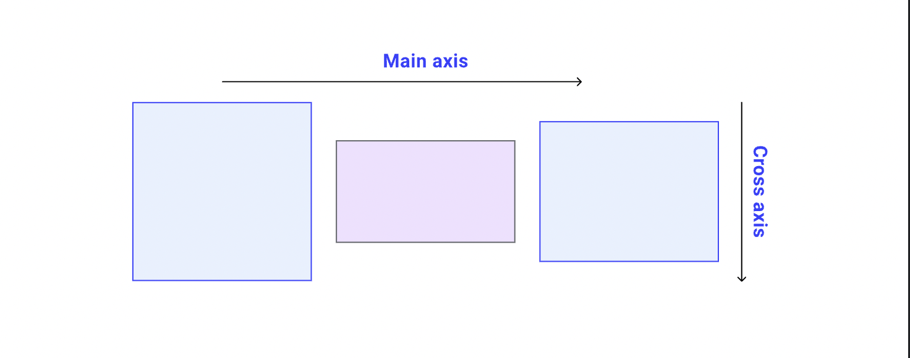
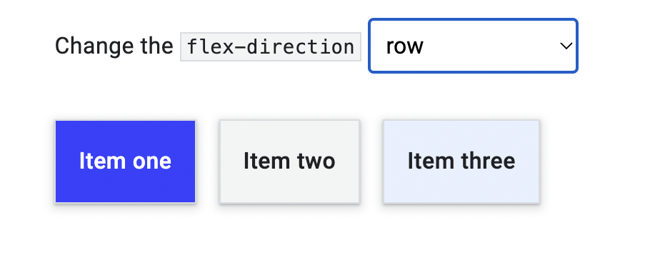
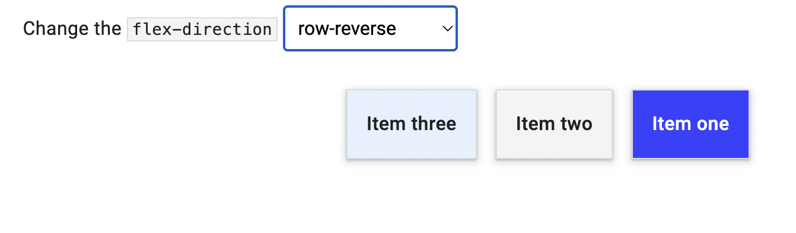
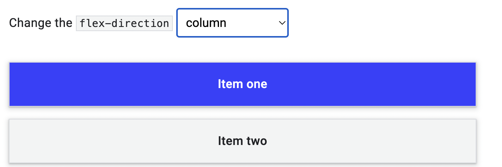
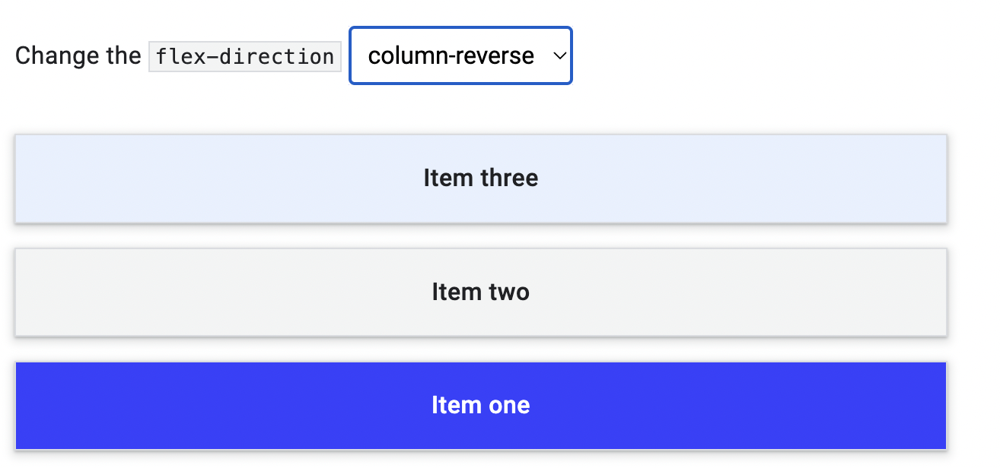
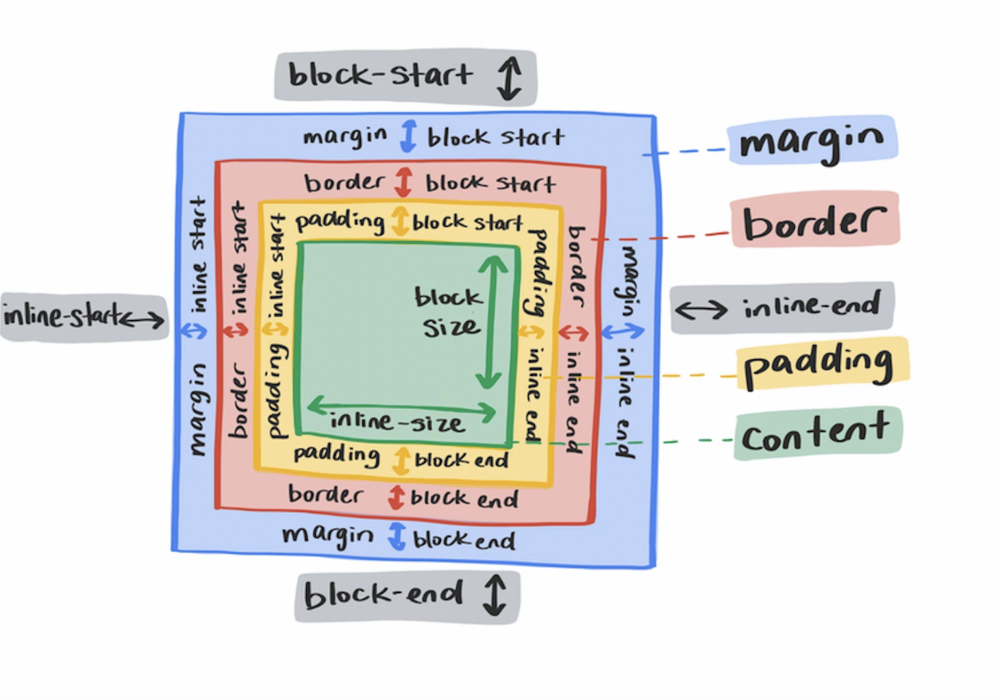
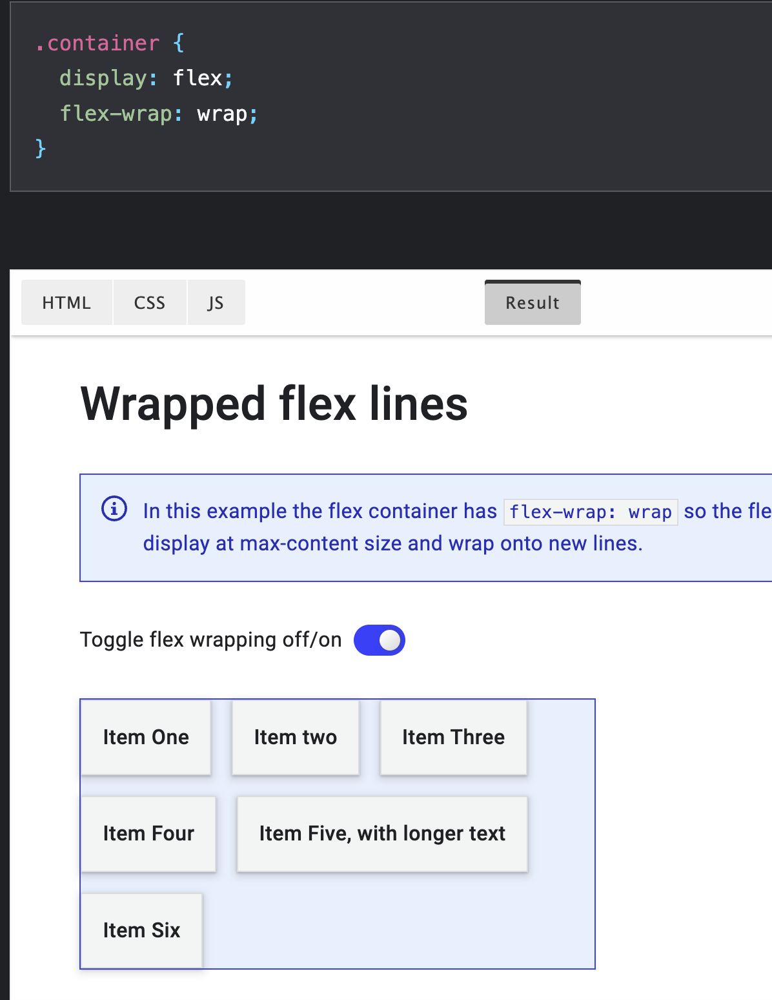
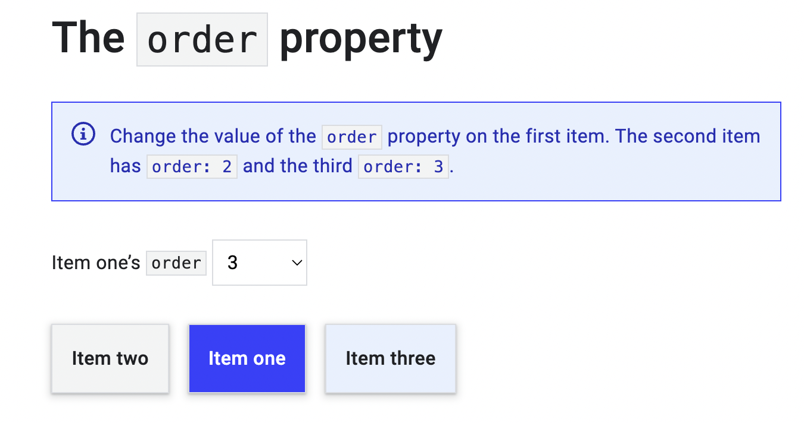

# FlexBox

The key to understanding flexbox is to understand the concept of a main axis and a cross axis.

## Why FlexBox?

The following simple layout designs are either difficult or impossible to achieve with such tools in any kind of convenient, flexible way:

- Vertically centering a block of content inside its parent.

- Making all the children of a container take up an equal amount of the available width/height, regardless of how much width/height is available.

- Making all columns in a multiple-column layout adopt the same height even if they contain a different amount of content.

## Float VS. FlexBox

Flexbox provides several advantages over using floats for layout:

- Responsive design: Flexbox makes it easier to create responsive layouts that adapt to different screen sizes and devices. With floats, it can be challenging to create a flexible layout that adjusts to different screen sizes and devices.

- Flexibility: Flexbox allows you to easily change the layout of your elements without changing the HTML structure. With floats, changing the layout often requires modifying the HTML structure.

- Alignment: Flexbox provides powerful alignment options that make it easy to center elements vertically and horizontally. Floats do not have built-in alignment options.

- Order: Flexbox allows you to change the order of your elements without changing the HTML structure. This is useful for creating responsive layouts where you want to re-order elements on different screen sizes. With floats, changing the order of elements can be challenging.

- Control over spacing: Flexbox allows you to control the spacing between elements with precision. With floats, spacing can be difficult to manage, especially when dealing with margin collapsing.

Overall, flexbox provides a more modern and flexible approach to layout than floats, and is generally easier to work with for creating responsive designs.

## Properties of flexbox negatively impact accessibility

While flexbox can be a powerful tool for creating flexible and responsive layouts, there are certain properties of flexbox that can negatively impact accessibility if not used correctly. Here are a few examples:

- Order property: The order property allows you to change the order of elements on the page without changing the HTML structure. While this can be useful for creating responsive designs, it can also be confusing for users who rely on screen readers to navigate the page. If the order of content is not logical, it can make it difficult for screen reader users to understand the page structure.

- Flex-direction property: The flex-direction property allows you to change the direction in which elements are laid out. However, changing the direction of the layout can be confusing for users who rely on assistive technology. For example, if you change the flex-direction from row to column, it can be difficult for users to follow the content flow.

- Flex-wrap property: The flex-wrap property allows you to specify whether flex items should wrap or not when they exceed the container width. However, wrapping content can be difficult for users who rely on assistive technology, as it can make it harder to understand the page structure and navigate the content.

- Use of visual cues: Flexbox often relies on visual cues to convey layout information, such as the use of alignment and spacing properties. However, users who rely on assistive technology may not be able to see these visual cues, so it's important to use alternative methods, such as ARIA roles and attributes, to convey layout information.

## Flex-Direction

The main axis is the one set by your flex-direction property. If that is row your main axis is along the row, if it is column your main axis is along the column.

`The cross axis runs in the other direction to the main axis, so if flex-direction is row the cross axis runs along the column.`

- row: the items lay out as a row.

- row-reverse: the items lay out as a row from the end of the flex container.

- column: the items lay out as a column.

- column-reverse : the items lay out as a column from the end of the flex container.

You can do two things on the cross axis. `You can move the items individually or as a group`, so they align against each other and the flex container. Also, `if you have wrapped flex lines, you can treat those lines as a group to control how space is assigned` to those lines.

## Flex Formatting

To use flexbox you need to declare that you want to use a flex formatting context and not regular block and inline layout. Do this by changing the value of the `display` property to `flex`.

## Flex-Wrap

The initial value of the flex-wrap property is nowrap. This means that if there is not enough space in the container the items will overflow.

To cause the items to wrap add `flex-wrap`: wrap to the flex container.

## Flex-Flow

You can set the flex-direction and flex-wrap properties using the shorthand flex-flow. For example, to set flex-direction to column and allow items to wrap:

`.container {`

  `display: flex;`

  `flex-flow: column wrap;`

`}`

## Controlling space inside flex items

- flex-grow: 0: items do not grow.

- flex-shrink: 1: items can shrink smaller than their flex-basis.

- flex-basis: auto: items have a base size of auto.

## Flex Order

Items in your flex container can be reordered using the order property. This property allows the ordering of items in ordinal groups. Items are laid out in the direction dictated by flex-direction, lowest values first. If more than one item has the same value it will be displayed with the other items with that value.

## Flex alignment

The set of properties can be placed into two groups. Properties for space distribution, and properties for alignment. The properties which distribute space are:

- justify-content: space distribution on the `main axis`.

- align-content: space distribution on the `cross axis`.

- place-content: a shorthand for setting `both of the above properties`.

- align-self: aligns a single item on the `cross axis`.

- align-items: aligns **all** of the items as a group on the `cross axis`.

## Align Items Vs Align Content

Both "align-items" and "align-content" are CSS properties that are used to control the vertical alignment of flex items within a flex container. However, they have different purposes and apply in different contexts.

"align-items" is a property that is used to align flex items vertically within the flex container. It applies to the individual flex items within the container and is used to set the default vertical alignment of each item. This property affects the alignment of the items along the cross-axis, which is perpendicular to the main axis of the flex container. The values for "align-items" are: "stretch" (default), "flex-start", "flex-end", "center", and "baseline".

"align-content" is a property that is used to align the entire set of flex items within the flex container. It applies to the flex container itself and is used to set the vertical alignment of the entire group of items. This property affects the alignment of the items along the cross-axis in the case when the total size of the items is smaller than the container size. The values for "align-content" are: "stretch" (default), "flex-start", "flex-end", "center", "space-between", "space-around", and "space-evenly".

In summary, "align-items" is used to set the default vertical alignment of each individual item within the container, while "align-content" is used to set the vertical alignment of the entire group of items within the container.

### Connection to Long Term Goals

Flex box will help me learn how to make a website look more presentable.

