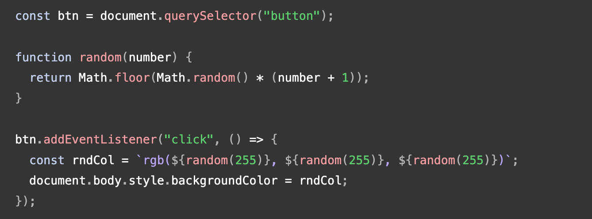
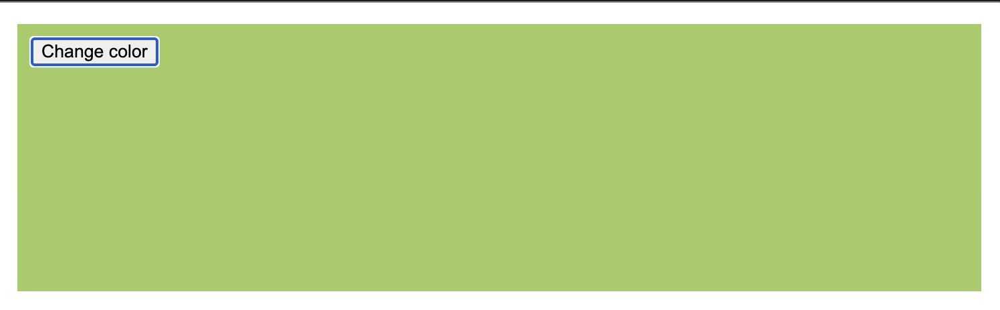
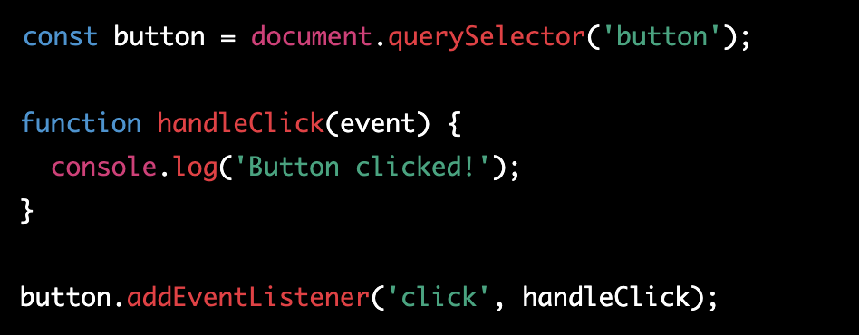

# Web Forms

Forms allow users to enter data, which is generally sent to a web server for processing and storage or used on the client-side to immediately update the interface in some way. A web form's HTML is made up of one or more form controls (sometimes called widgets), plus some additional elements to help structure the overall form — they are often referred to as HTML forms.

## Why are forms so important in web development?

- Data Collection: Forms enable websites to collect data from users. This data can be used to personalize user experiences, improve marketing campaigns, and gain insights into user behavior.

- User Interaction: Forms enable users to interact with websites and take specific actions, such as submitting feedback or making a purchase. Without forms, users would not be able to engage with websites in meaningful ways.

- Communication: Forms can facilitate communication between website owners and users. Contact forms, for example, enable users to reach out to website owners with questions, concerns, or feedback.

- Validation: Forms can help ensure that users enter accurate and valid data. This is important for ensuring the quality of the data collected and for preventing errors or security issues.

- Security: Forms can be used to authenticate users and protect sensitive information. For example, login forms require users to enter a username and password to access protected content.

## When designing a form, what are some key things to keep in mind when it comes to user experience?

Keep it Simple: Try to keep the form as simple and straightforward as possible. Avoid asking for unnecessary information and use clear and concise language.

Use Visual Hierarchy: Use visual design to create a clear visual hierarchy that guides the user's attention to the most important elements of the form, such as the field labels, error messages, and submit button.

Label Fields Clearly: Use clear and descriptive labels for each form field. Avoid using jargon or technical terms that users may not understand.

Provide Feedback: Provide feedback to users as they fill out the form. This can include inline validation to notify users of errors in real-time or confirmation messages after the form has been submitted.

Make it Mobile-Friendly: Ensure the form is optimized for mobile devices. Use a responsive design that adjusts to different screen sizes and make sure the form is easy to navigate and complete on a mobile device.

Test and Iterate: Test the form with real users to identify any usability issues and make changes based on their feedback. Continuously iterate and improve the form based on user feedback and metrics.

## HTML Forms

HTML forms are used to collect user input on the web. They allow users to enter data such as text, numbers, and dates, as well as make selections from drop-down menus, checkboxes, and radio buttons.

## Form Structure

HTML forms are created using the `<form>` element, which contains one or more form elements such as text inputs, buttons, and dropdown menus. Each form element is given a unique name attribute to identify it in the server response.

## Form Methods

The `<form>` element has two methods for submitting form data to the server: GET and POST. GET is used to retrieve data from the server, while POST is used to send data to the server.

## Input Types

HTML provides several input types, including text, email, number, date, checkbox, radio buttons, and more. Each input type has different attributes and options for formatting and validation.

## Form Validation

Form validation ensures that user input is correct and complete before submitting it to the server. HTML provides built-in validation attributes such as required, pattern, and min/max values, while JavaScript can be used to create custom validation rules.

## Form Styling

HTML forms can be styled using CSS to make them more visually appealing and user-friendly.

## List 5 of form elements and explain their importance

### Text Input

Text input is one of the most common form elements and allows users to enter text into a form field. This element is important because it enables users to provide information, such as their name, email, address, and other details. It is also essential to ensure that the input field is appropriately labeled and validated to ensure accurate data entry.

### Radio Buttons

Radio buttons are a form element that allows users to select a single option from a list of predefined choices. They are useful for presenting options that are mutually exclusive, such as gender or payment method. The use of radio buttons can simplify the form and make it easier for users to complete.

### Checkboxes

Checkboxes allow users to select one or more options from a list of predefined choices. They are useful for presenting options that are not mutually exclusive, such as interests or subscription preferences. Checkboxes are important because they give users more control over their choices and allow for more complex data collection.

## Dropdowns

Dropdowns allow users to select one option from a list of predefined choices that are presented in a dropdown menu. Dropdowns are useful for presenting a large number of options or organizing options into categories. They help simplify the form and save space on the page.

## Submit Button

The submit button is the final form element that the user interacts with. It is essential to ensure that the submit button is prominent and easily visible, indicating to users that they have completed the form and can now submit their information. The submit button should also be labeled clearly, indicating what will happen when it is clicked, such as "submit" or "send."

## Javascript

Events are things that happen in the system you are programming — the system produces (or "fires") a signal of some kind when an event occurs, and provides a mechanism by which an action can be automatically taken (that is, some code running) when the event occurs.

For example:

- The user selects, clicks, or hovers the cursor over a certain element.

- The user chooses a key on the keyboard.

- The user resizes or closes the browser window.

- A web page finishes loading.

- A form is submitted.

- A video is played, paused, or ends.

- An error occurs.

To react to an event, you attach an event handler to it. This is a block of code (usually a JavaScript function that you as a programmer create) that runs when the event fires. 

Example:

Output:

The HTML `<button>` element will fire an event when the user clicks the button. So it defines an addEventListener() function, which we are calling here. We're passing in two parameters:

- the string "click", to indicate that we want to listen to the click event. Buttons can fire lots of other events, such as "mouseover" when the user moves their mouse over the button, or "keydown" when the user presses a key and the button is focused.

- a function to call when the event happens. In our case, the function generates a random RGB color and sets the background-color of the page `<body>` to that color.

## Listening for other events

- focus and blur — The color changes when the button is focused and unfocused; try pressing the tab to focus on the button and press the tab again to focus away from the button. These are often used to display information about filling in form fields when they are focused, or to display an error message if a form field is filled with an incorrect value.

- dblclick — The color changes only when the button is double-clicked.

- mouseover and mouseout — The color changes when the mouse pointer hovers over the button, or when the pointer moves off the button, respectively.

## Summary:

Events and event handling: Events are actions or occurrences that happen in a web page, such as a button click, mouse movement, or keyboard press. Event handling is the way of detecting and responding to these events in JavaScript code.

Event listeners: An event listener is a function that is called when a specific event occurs on an element. It is used to listen for a particular event and respond to it in some way.

Event propagation: Event propagation is the process by which events are passed from the outermost ancestor element down to the target element that triggered the event. There are two types of event propagation: bubbling and capturing.

Event objects: An event object is a JavaScript object that contains information about an event, such as its type, target element, and any additional data related to the event.

Event delegation: Event delegation is a technique where you attach an event listener to a parent element instead of the individual child elements. This can improve performance and reduce code complexity when dealing with large numbers of elements.

Common event types: The article covers some of the most commonly used event types, such as click, mouseover, keydown, and submit, and provides examples of how to handle them using event listeners.

## Describe events to a non-technical friend

Events are occurrences that happen at a specific time and place. They can be anything from a birthday party to a concert or a business conference. Events usually have a purpose or a theme, and people attend them for various reasons, such as to celebrate, learn, network, or socialize.

In the context of technology, events can also refer to notifications or messages that are triggered by a specific action or occurrence, such as a user clicking a button or a system error being detected. These events can be used to automate processes or trigger responses in software applications.

## When using the addEventListener() method, what 2 arguments will you need to provide?

When using the addEventListener() method, you need to provide two arguments:

The first argument is a string that specifies the `type `of event you want to listen for, such as `"click", "mouseover", "keydown", or "submit"`. This represents the name of the event that you want to handle.

The second argument is a function that will be `called when the event is triggered`. This function is also known as the `"event handler"` or `"callback function"`, and it defines the behavior that should occur in response to the event. When the event is triggered, the browser will call this function, passing in an "event" object as an argument that contains information about the event, such as the target element or the mouse position.

## Describe the event object. Why is the target within the event object useful?

In this example, the addEventListener() method is called on the button element, specifying that we want to listen for the "click" event. The second argument is the handleClick() function, which will be called when the button is clicked. When the button is clicked, the browser will call the handleClick() function and log the message "Button clicked!" to the console.

The event object is a special object that has information about something that just happened, like when you click on a button or move your mouse over a picture. The event object is like a message that your computer sends to your web page, telling it what just happened.

One important thing that's inside the event object is the "target". The target is like a piece of information that tells you exactly what got clicked or what you moved your mouse over. It's like a label that helps you know which part of the web page was involved in the event.

The target can be really useful because it helps you figure out what to do next. For example, if you have a bunch of buttons on your web page, you can use the target to figure out which button was clicked, and then you can do something specific based on that. So the target helps you know what to do with the event that just happened.

Overall, the event object is like a special message that tells your web page what just happened, and the target is a specific piece of information inside that message that helps you know which part of the web page was involved.

The event object is a special object that has information about something that just happened, like when you click on a button or move your mouse over a picture. The event object is like a message that your computer sends to your web page, telling it what just happened.

One important thing that's inside the event object is the "target". The target is like a piece of information that tells you exactly what got clicked or what you moved your mouse over. It's like a label that helps you know which part of the web page was involved in the event.

The target can be really useful because it helps you figure out what to do next. For example, if you have a bunch of buttons on your web page, you can use the target to figure out which button was clicked, and then you can do something specific based on that. So the target helps you know what to do with the event that just happened.

Overall, the event object is like a special message that tells your web page what just happened, and the target is a specific piece of information inside that message that helps you know which part of the web page was involved.

## What is the difference between event bubbling and event capturing?

Event bubbling and event capturing are two different ways that events can move through a web page. Imagine you have a bunch of boxes on your web page, and you click on one of them. The event (click) will start at the box you clicked on, and then move up and down through the other boxes, in one of two ways: bubbling or capturing.

`Event bubbling` is like dropping a pebble in the water and watching the ripples spread outwards. When an event happens on an element (like a click), it starts at that element and then "bubbles up" through its parent elements, triggering any event listeners along the way. So if you have a button inside a div inside a section, and you click on the button, the click event will first trigger on the button, then on the div, and finally on the section.

`Event capturing`, on the other hand, is like pouring water into a funnel and watching it flow downwards. When an event happens, it starts at the top of the page (the "root" element) and then moves down through the parent elements to the element where the event occurred, triggering any event listeners along the way. So if you have a button inside a div inside a section, and you click on the button, the click event will first trigger on the section, then on the div, and finally on the button.

The main difference between bubbling and capturing is the order in which the events are triggered. With bubbling, `the event starts at the element where it occurred and moves up through the parents`, while with capturing, `the event starts at the top of the page and moves down through the parents`. In practice, most event listeners use bubbling, since it's the default behavior and usually more intuitive for developers.

Overall, event bubbling and capturing are just different ways that events can move through a web page. Bubbling starts at the element where the event occurred and moves up through the parents, while capturing starts at the top of the page and moves down through the parents.