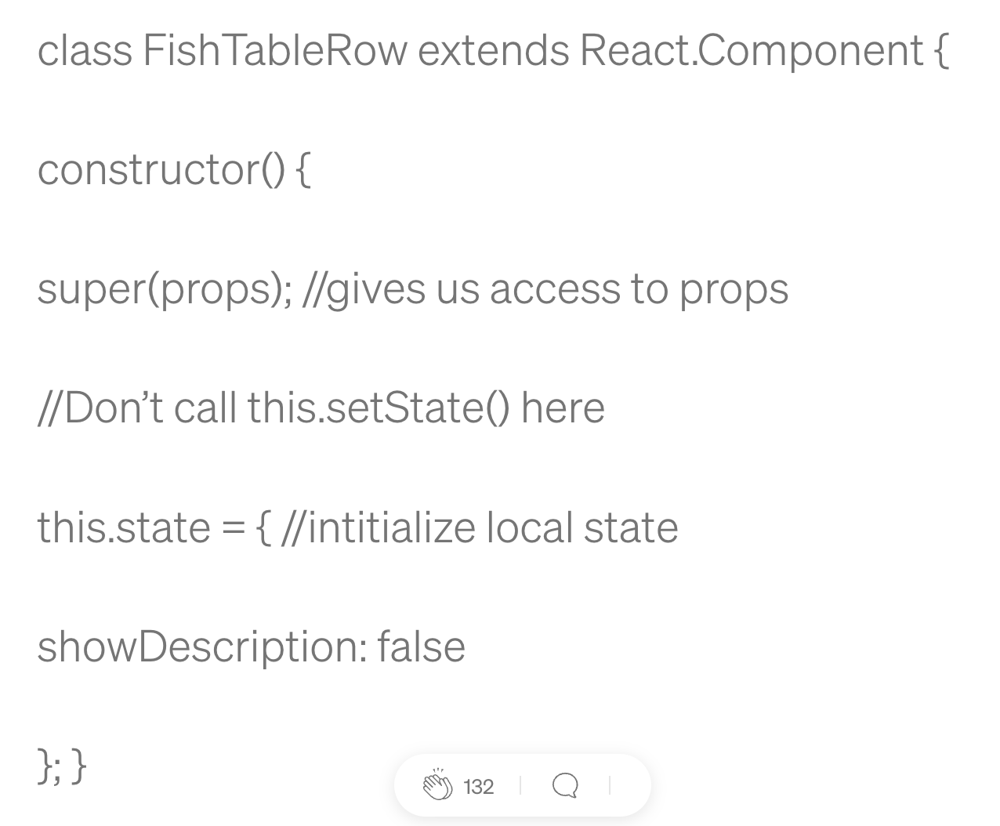
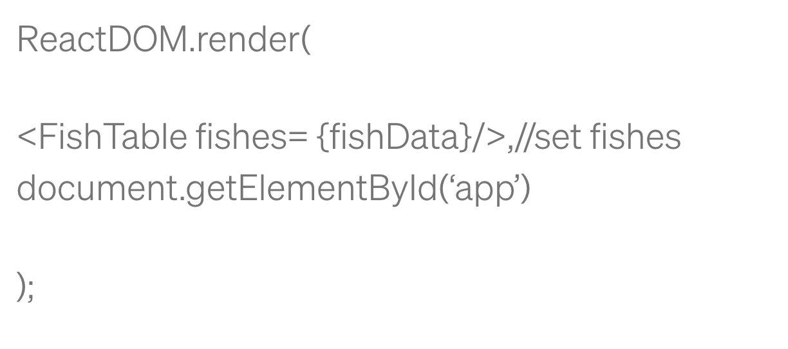

# State and Props

## React Lifecycle

React lets you define components as classes or functions. The methods that you are able to use on these are called `lifecycle events`.

Methods that are called allow you to update the UI and application states.

Mounting, Updating, and Unmounting are the three phases of the component lifecycle.

### Mounting

During the process of adding a component to a web page, there is a step called "mounting" where the component is created and placed onto the page.

#### Mounting Order

- `Constructor`

  - This is the first method called when a component is created. It is used to initialize the state and bind event handlers to the component instance.

- `static getDerivedStateFromProps`

  - This is a static method that is called before the
    component is rendered for the first time, as well as
    any time the component is updated with new props. It
    allows the component to update its internal state
    based on the props that were passed to it.

- `render`

  - This method is called to generate the initial
    virtual DOM for the component. It returns a tree of
    React elements that will be used to create the
    actual DOM nodes.

- `componentDidMount`

  - This method is called after the component is mounted
    onto the DOM. It allows the component to perform any
    side effects that are necessary, such as fetching
     data from a server or setting up event listeners.

- `UNSAFE_componentWillMount`

  - This method is called just before the component is mounted
   onto the DOM. It is considered unsafe to use and may be
    removed in future versions of React.

`All occur in this order during mounting.`

### Updating

Anytime a component is updated or state changes then it is rerendered. These lifecycle events happen during updating in this order.

#### Updating Order

- `static getDerivedStateFromProps`

  - This is a static method that is called every time a component is updated with new props. It allows the component to update its internal state based on the new props. It returns an object that represents the updated state or null if no update is needed.

- `shouldComponentUpdate`

  - This method is called before the component is re-rendered. It allows the component to determine whether it should update or not. It returns a boolean value, true if the component should update, false otherwise.

- `render`
  - This method is called before the component is re-rendered. It allows the component to determine whether it should update or not. It returns a boolean value, true if the component should update, false otherwise.

- `getSnapshotBeforeUpdate`

  - This method is called immediately before the component is updated with the new virtual DOM. It allows the component to capture some information about the current state of the DOM before it is updated.

- `componentDidUpdate`

  - This method is called after the component is updated with the new virtual DOM. It allows the component to perform any side effects that are necessary, such as updating the DOM or making network requests.

- `UNSAFE_componentWillUpdate`

  - This method is called just before the component is updated with the new virtual DOM. It is considered unsafe to use and may be removed in future versions of React.

- `UNSAFE_componentWillReceiveProps`

  - This method is called when the component is about to receive new props. It is considered unsafe to use and may be removed in future versions of React.

## Unmounting

The final phase of the lifecycle if called when a component is being removed from the DOM. `componentWillUnmount` is the only lifecycle event during this phase.

## Order Unmounting

- constructor

  - In React, when you create a component, its constructor
    function is called first. If you're using a subclass, make
    sure to include super(props) inside the constructor or
    else the component's properties won't be defined.

  - You can use the constructor to set up the initial state of
   the component using this.state. You can also use it to
    connect event handlers to the component instance.

  - Think of it like building a car. Before you can drive it,
   you need to make sure all the parts are there and connected
    properly. The constructor is like the assembly line where
    all the parts are put together before the car is ready to
    hit the road.

Avoid using this.setState() in the constructor because it can lead to side effects, and it is unnecessary. Doing this will ignore all updates to props, so it shouldn’t be done unless it is intentional.

- `static getDerivedStateFromProps()`

This method exists for rare cases where the state relies on changes in props over time.

- `render()`

  - Render is the only required method in a class component.
   It will examine this.props and this.state when called. The
    render function should not modify the component state
    because it would cause a lot of bugs by changing the
    state every time it rerenders. I also should not directly
    interact with the browser. render will not be invoked if
    shouldComponentUpdate() returns false. Here is an example
    of using render.

- `componentDidMount()`

  - This method is invoked immediately after a component is
   mounted. If you need to load anything using a network
    request or initialize the DOM, it should go here. This
    method is a good place to set up any subscriptions. If
    you do that, don’t forget to unsubscribe in
    `componentWillUnmount()`.

    `setState()` can be called here, but it should be used
    sparingly, because it will cause a rerender, which can
    lead to perfomance issues.

- `shouldComponentUpdate()`

  - The default behavior in react is to rerender after every state change. Setting `shouldComponentUpdate()` to false allows you to prevent this from happening. This is in order to optimize performance. If you want to use this method, it may be better to use PureComponent instead, which performs a shallow comparison of props and state. If you do decide to use this method, be sure to check the previous props and state with the current props and state. If shouldComponentUpdate() returns false, then UNSAFE_componentWillUpdate(), render(), and componentDidUpdate() will not be invoked.

## Props Vs State

- State and props are both important concepts in React that deal with managing and passing data between components.

- State refers to an object that holds data that can change over time within a component. It is used to manage and update a component's internal data.

- Props, short for properties, are read-only data that are passed down from a parent component to a child component. They are used to customize a component and can be thought of as the component's configuration.

- One key difference between state and props is that state is managed within a component, while props are passed down from a parent component.

- Another difference is that state can only be updated within the component it belongs to, while props are read-only and cannot be directly changed within the component that receives them.

- To pass data from a parent component to a child component, you can use props. You can also pass down functions as props to allow the child component to update the parent's state.

- To update state within a component, you can use the setState method. This method merges the new state with the existing state, and then triggers a re-render of the component with the updated state.

- It's important to note that when updating state, you should never directly modify the state object, but instead create a new object that represents the updated state.

- When working with state and props, it's important to think about the data flow within your application and how you can structure your components to best manage and pass data between them.

### What types of things can you pass in the props?

In React, you can pass any JavaScript data type as props. Here are some examples of the types of things you can pass as props:

- Strings, numbers, and boolean values

- Objects and arrays

- Functions and callbacks

- JSX elements

- React components

- Props themselves can be passed as props (i.e., you can nest components and pass props down the component tree)

### What is the big difference between props and state?

Here are some key differences between props and state:

- `Origin`: Props are passed down from a parent component, while state is defined and managed within a component.

- `Mutability`: Props are read-only and cannot be modified within a component, while state can be updated using the setState method.

- `Ownership`: The ownership of props lies with the parent component, while the ownership of state lies with the component that defines it.

- `Purpose`: Props are used to pass data and behavior down the component tree, while state is used to manage and update internal data within a component.

- `Scope`: Props are accessible to the component that receives them and its children, while state is only accessible within the component that defines it.

### When do we re-render our application?

`Change in state`: Whenever the setState method is called within a component, it triggers a re-render of that component with the updated state.

`Change in props`: Whenever a component's props are updated from its parent component, it triggers a re-render of that component with the new props.

`Context update`: If a component is consuming data from a React context, a change in the context value can trigger a re-render of that component.

`User input`: When the user interacts with a component, such as clicking a button or entering text into an input field, it can trigger a change in the component's state and trigger a re-render.

`Routing`: If your React application uses a routing library, such as React Router, a change in the URL can trigger a re-render of the relevant components.

### What are some examples of things that we could store in state?

`Form input values`: If you have a form that the user interacts with, you might store the input values in the component's state and update them as the user types.

`Component visibility`: If you have a component that is conditionally rendered based on some user interaction, you might store a boolean value in the component's state to control its visibility.

`API responses`: If you're making an API call from within a component, you might store the response data in the component's state and render it once the data is received.

`User authentication state`: If your application requires user authentication, you might store a boolean value in the component's state to track whether the user is authenticated or not.

`Loading state`: If you have a component that needs to fetch data asynchronously, you might store a boolean value in the component's state to indicate whether the data is still loading or has been fetched.

`Error messages`: If your component needs to handle errors, you might store an error message in the component's state and render it when an error occurs.

