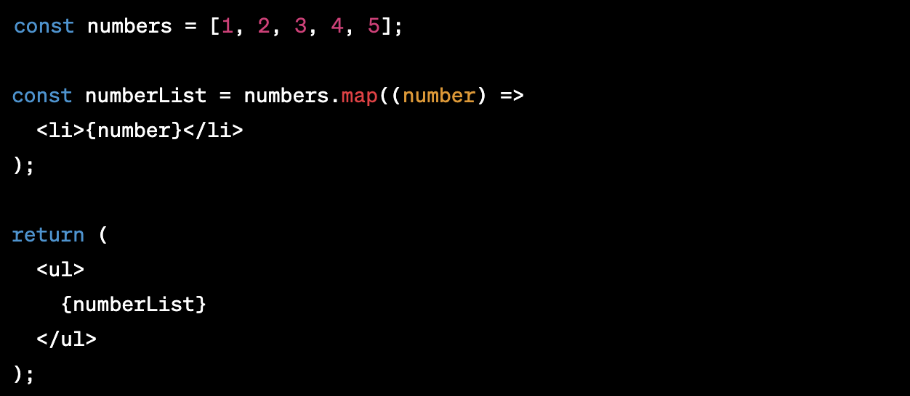
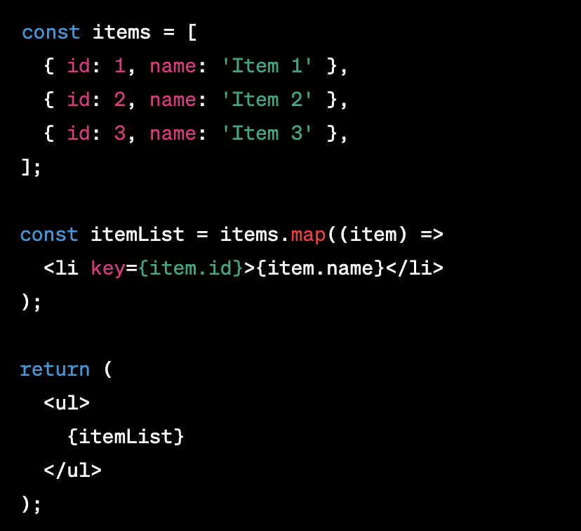
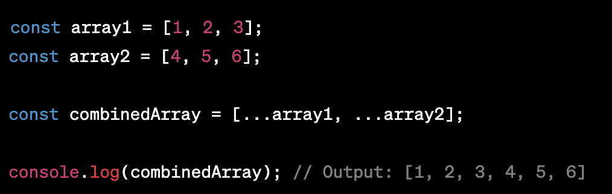
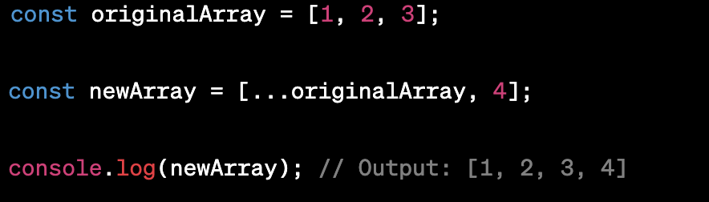
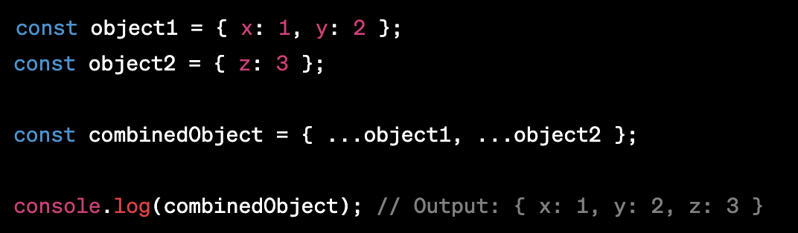
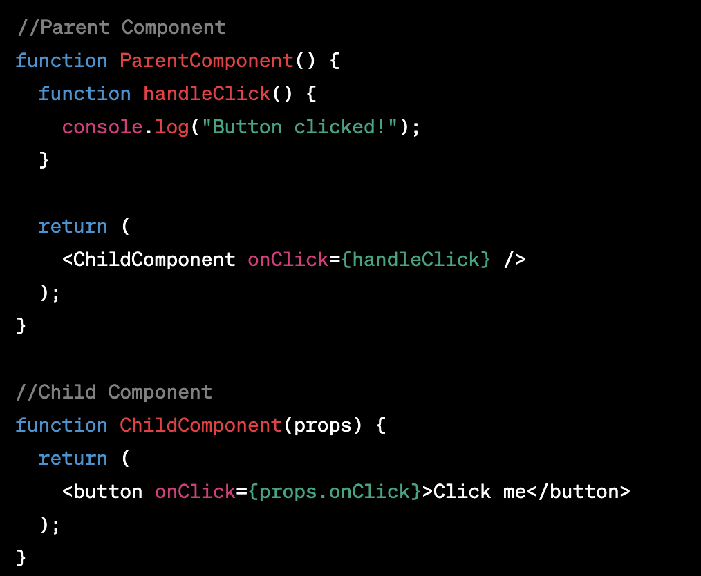
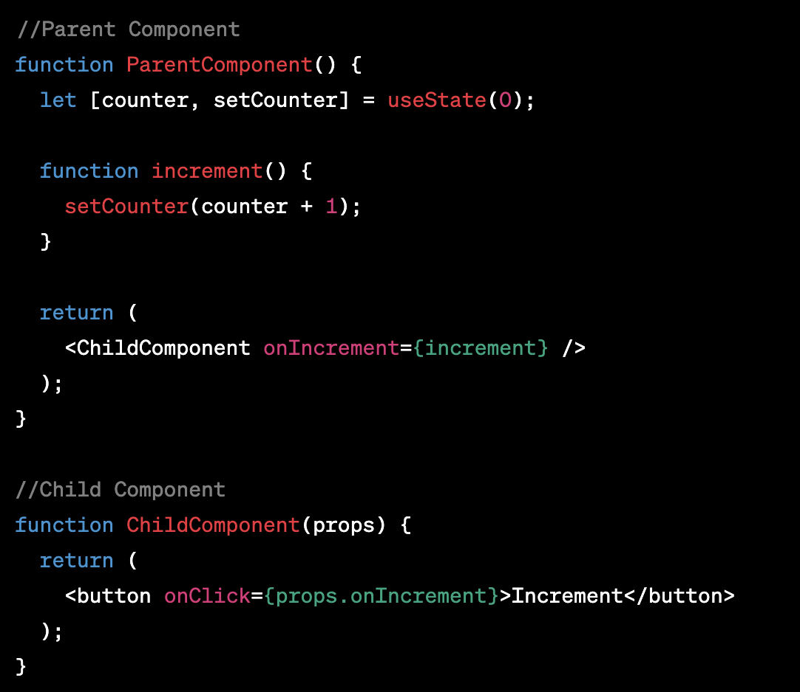
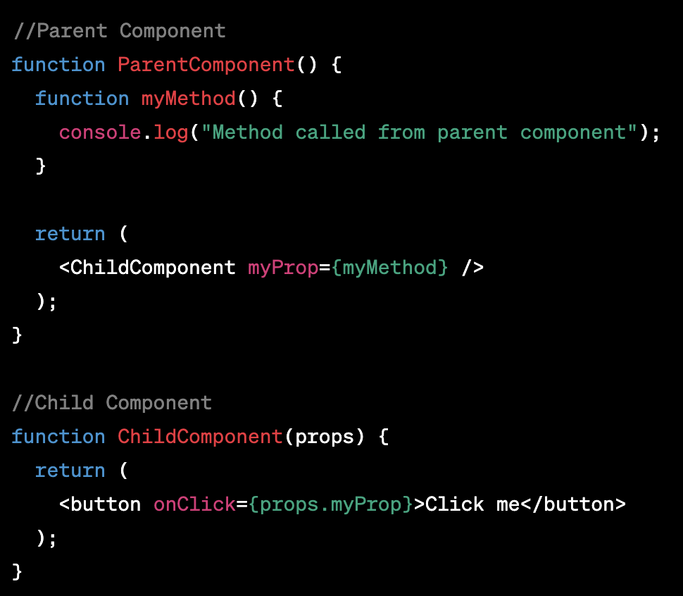
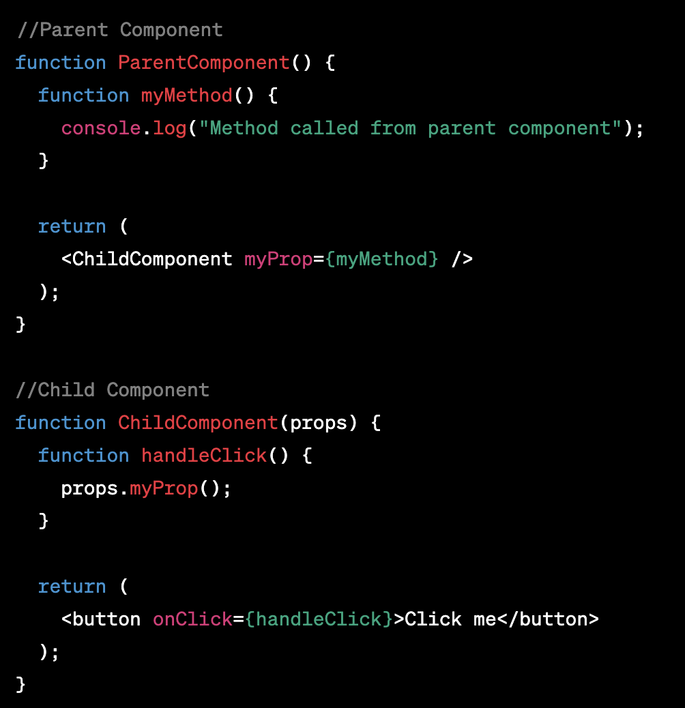

# Passing Functions as Props

## What does .map() return?

`.map()` is a built-in method in JavaScript that can be used to iterate over an array and perform an operation on each element of the array. It returns a new array that is the result of applying the operation to each element of the original array. For example, if we have an array of numbers [1, 2, 3], we can use `.map()` to create a new array with each number multiplied by 2: [2, 4, 6]. The `.map()` method is commonly used in React to create lists of elements based on data in an array.

If I want to loop through an array and display each value in JSX, how do I do that in React?
To loop through an array and display each value in JSX, we can use the `.map()` method in combination with JSX. Here's an example:

In this example, we have an array of numbers and we want to display each number in an unordered list using JSX. We use the .map() method to create a new array of `<li>` elements, with each element containing a number from the original array. We then include the numberList array inside the `<ul>` element to display the list on the page.

## Each list item needs a unique __key__.

Each list item needs a unique "key". When we create a list of elements in React, we need to include a "key" prop on each element. This helps React keep track of which items have been added, removed, or modified in the list. The "key" should be a unique identifier for each item in the list, such as an ID or a unique value from the data. For example:

In this example, we have an array of items with each item containing an id and a name. We create a list of `<li>` elements using .map(), and we include a key prop on each element with the id of the item. This ensures that each item in the list has a unique identifier that React can use to manage the list efficiently.

## What is the purpose of a key?

The purpose of a __"key"__ in React is to help the library keep track of which items have been added, removed, or modified in a list of elements. When we create a list of elements in React, we need to include a __"key"__ prop on each element. This key should be a unique identifier for each item in the list, such as an ID or a unique value from the data. React uses the key to identify which elements in the list have changed, and it updates the UI accordingly. Without a __key__, React would have to rerender the entire list every time a change occurs, which can be slow and inefficient. By using keys, React can update only the necessary parts of the list, resulting in a faster and more efficient UI.

The spread operator is a syntax feature in JavaScript that allows you to expand or spread iterable objects like arrays, strings, or objects into individual elements. It is denoted by three dots (…) and is used in several contexts to make working with collections more concise and expressive.

Four things that the spread operator can do are:

- Copying arrays: You can use the spread operator to create a shallow copy of an existing array. This means that any changes made to the new array won't affect the original array.

- Merging arrays: You can use the spread operator to merge two or more arrays into a single array.

- Adding items to arrays: You can use the spread operator to add one or more items to an existing array.

- Copying and merging objects: You can use the spread operator to create a shallow copy of an existing object or to merge two or more objects into a single object.

Example of using the spread operator to combine two arrays:

Example of using the spread operator to add a new item to an array:

Example of using the spread operator to combine two objects into one:

## How to Pass Functions between Components

In the video, what is the first step that the developer does to pass functions between components?

The first step that the developer does to pass functions between components is to define the function in the parent component and then pass it as a prop to the child component.

In your own words, what does the increment function do?

In the video, the increment function is a simple function that increases the value of a counter by 1 each time it is called. It is used as an example to demonstrate how to pass a function from a parent component to a child component.

How can you pass a method from a parent component into a child component?

To pass a method from a parent component into a child component, the method is defined in the parent component and then passed down to the child component as a prop.

How does the child component invoke a method that was passed to it from a parent component?

The child component can invoke a method that was passed to it from a parent component by calling it as a function using the props that were passed down to it.

