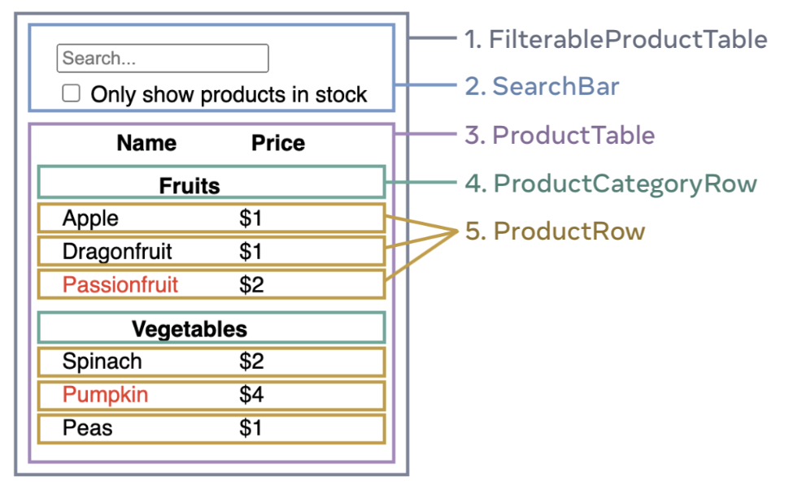

# Thinking in React

### Step 1: Break the UI into a component hierarchy

Start by analyzing the design and identifying the main components and subcomponents. These could include a header, footer, navigation menu, content areas, buttons, forms, images, and other visual elements.

Once you have identified the components, create boxes around them and label each box with the component name. For example, you may have a box labeled "Header" at the top of the diagram, a box labeled "Navigation Menu" below the header, and a box labeled "Main Content" in the center of the diagram.

Next, identify any subcomponents within each main component. For example, within the "Header" component, you may have a logo and a search bar. Within the "Main Content" component, you may have sections for featured content, recent content, and trending content.

Create smaller boxes within each main component box to represent the subcomponents, and label each box with the subcomponent name. For example, within the "Header" component box, you may have a smaller box labeled "Logo" and another labeled "Search Bar."

Finally, use arrows or lines to indicate the flow of the design, showing how users navigate through the different components and subcomponents. This will create a visual representation of the overall user flow and help you better understand the design structure.



- FilterableProductTable (grey) contains the entire app.

- SearchBar (blue) receives the user input.

- ProductTable (lavender) displays and filters the list according to the user input.

- ProductCategoryRow (green) displays a heading for each category.

- ProductRow (yellow) displays a row for each product.

  - FilterableProductTable(Parent)

    - SearchBar

    - ProductTable

      - ProductCategoryRow

      - ProductRow

### Step 2: Build a static version in React

To build your app, you need to create different parts of your app called components. These components will take data from a data model and use it to display the information on the screen. You can think of these components like building blocks that you can put together to create your app.

First, you will create the static version of your app by creating the components and passing data to them using props. Props are like messages that are passed from one component to another to make sure they have the information they need.

You can start building your components either from the top of the hierarchy (like the FilterableProductTable) or from the bottom (like the ProductRow).

Once you have built all your components, you can put them together to create your app. This is called one-way data flow, which means that the data moves from the top of the hierarchy to the bottom.

Remember, for this static version of your app, you don't need to worry about interactivity or data that changes over time. You can save that for later!

### Step 3: Find the minimal but complete representation of UI state

Think of state as the minimal set of changing data that your app needs to remember. The most important principle for structuring state is to keep it DRY (Don’t Repeat Yourself). Figure out the absolute minimal representation of the state your application needs and compute everything else on-demand.

Now think of all of the pieces of data in this example application:

- The original list of products

- The search text the user has entered

- The value of the checkbox

- The filtered list of products

### Props Vs State

There are two types of “model” data in React: `props` and `state`. The two are very different:

`Props` are like arguments you pass to a function. They let a parent component pass data to a child component and customize its appearance. For example, a Form can pass a color prop to a Button.

`State` is like a component’s memory. It lets a component keep track of some information and change it in response to interactions. For example, a Button might keep track of isHovered state.

Props and state are different, but they work together. A parent component will often keep some information in state (so that it can change it), and pass it down to child components as their props. It’s okay if the difference still feels fuzzy on the first read. It takes a bit of practice for it to really stick!

### Step 4: Identify where your state should live

Identify the component that owns or is responsible for changing the minimal state data of your app. Remember, in React, data flows down the component hierarchy from parent to child components. If you're new to this concept, figuring out which component should own what state can be challenging, but you can do it by following these steps.

- Identify every component that renders something based on that state.

- Find their closest common parent component—a component above them all in the hierarchy.

- Decide where the state should live:

    1. Often, you can put the state directly into their common parent.

    2. You can also put the state into some component above their common parent.

    3. If you can’t find a component where it makes sense to own the state, create a new component solely for holding the state and add it somewhere in the hierarchy above the common parent component.

In the previous step, you found two pieces of state in this application: the search input text, and the value of the checkbox. In this example, they always appear together, so it makes sense to put them into the same place.

### Step 5 Add inverse data flow 

Currently your app renders correctly with props and state flowing down the hierarchy. But to change the state according to user input, you will need to support data flowing the other way

React has a different approach to data flow that requires more typing than two-way data binding. For example, if you try to type or check the box in a React example, your input may be ignored. This is because you've set the value prop of the input to always be equal to a specific state passed in from a parent component. If that state is not updated, the input value remains unchanged.

```

import React, { useState } from 'react';

function FilterableProductTable() {
  const [filterText, setFilterText] = useState('');
  const [inStockOnly, setInStockOnly] = useState(false);

  return (
    <div>
      <SearchBar
        filterText={filterText}
        inStockOnly={inStockOnly}
        setFilterText={setFilterText}
        setInStockOnly={setInStockOnly}
      />
      <ProductTable
        products={PRODUCTS}
        filterText={filterText}
        inStockOnly={inStockOnly}
      />
    </div>
  );
}

function SearchBar({ filterText, inStockOnly, setFilterText, setInStockOnly }) {
  function handleFilterTextChange(event) {
    setFilterText(event.target.value);
  }

  function handleInStockChange(event) {
    setInStockOnly(event.target.checked);
  }

  return (
    <form>
      <input type="text" value={filterText} onChange={handleFilterTextChange} />
      <p>
        <input type="checkbox" checked={inStockOnly} onChange={handleInStockChange} />
        {' '}
        Only show products in stock
      </p>
    </form>
  );
}

const PRODUCTS = [
  { category: 'Sporting Goods', price: '$49.99', stocked: true, name: 'Football' },
  { category: 'Sporting Goods', price: '$9.99', stocked: true, name: 'Baseball' },
  { category: 'Sporting Goods', price: '$29.99', stocked: false, name: 'Basketball' },
  { category: 'Electronics', price: '$99.99', stocked: true, name: 'iPod Touch' },
  { category: 'Electronics', price: '$399.99', stocked: false, name: 'iPhone 5' },
  { category: 'Electronics', price: '$199.99', stocked: true, name: 'Nexus 7' }
];


```

In this example, we have a parent component called FilterableProductTable that owns the state filterText and inStockOnly. It renders two child components, SearchBar and ProductTable. The SearchBar component receives the props filterText, inStockOnly, setFilterText, and setInStockOnly.

The SearchBar component includes an input field for filterText and a checkbox for inStockOnly. When the user types in the input field or checks/unchecks the checkbox, the corresponding event handlers are called, which update the parent component's state using the setFilterText and setInStockOnly functions passed down as props.

The ProductTable component receives the props products, filterText, and inStockOnly, and renders a table based on those props.

This is just a simple example, but it illustrates how data flows in a one-way direction in React, from parent to child components, and how the parent component owns the state and controls how it gets updated.

### Summary

### What is the single responsibility principle and how does it apply to components?

The `Single Responsibility Principle` is a software design principle that states that each component or module should have only one reason to change. Applied to components in React, it means that a component should have a clear and well-defined purpose, and it should not try to do too many things at once. Each component should be responsible for rendering a specific part of the UI, and it should not have any unnecessary dependencies or responsibilities.

### What does it mean to build a ‘static’ version of your application?

Building a static version of your application means creating a version of your app that has no interactivity or dynamic behavior. It is a simplified version of your app that only renders the UI based on the props and data passed down to it. This allows you to focus on the UI and the component hierarchy without worrying about the underlying logic and state management.

### Once you have a static application, what do you need to add?

Once you have a static application, you need to add interactivity and dynamic behavior. This involves identifying the state that needs to be managed and determining which components should own that state. You also need to add event handlers and other logic to update the state based on user interactions.

### What are the three questions you can ask to determine if something is state?

The three questions you can ask to determine if something is state are:

- Is it passed in from a parent via props? If so, it probably isn't state.

- Does it remain unchanged over time? If so, it probably isn't state.

- Can you compute it based on any other state or props in your component? If so, it isn't state.

### How can you identify where state needs to live?

To identify where state needs to live, you can follow these steps:

Identify all the components that render something based on that state.
Find a common owner component (a single component above all the components that need the state in the hierarchy).
Either the common owner or another component higher up in the hierarchy should own the state.
If you can't find a component where it makes sense to own the state, create a new component solely for holding the state and add it somewhere in the hierarchy above the common owner component.
