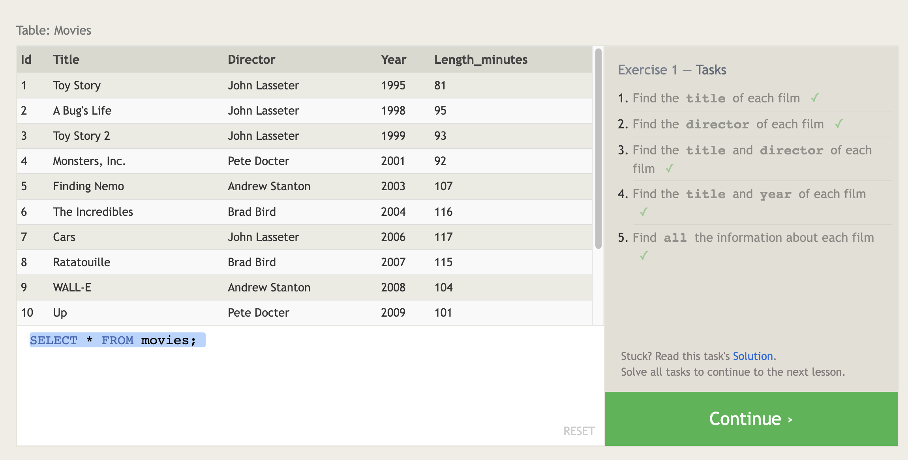
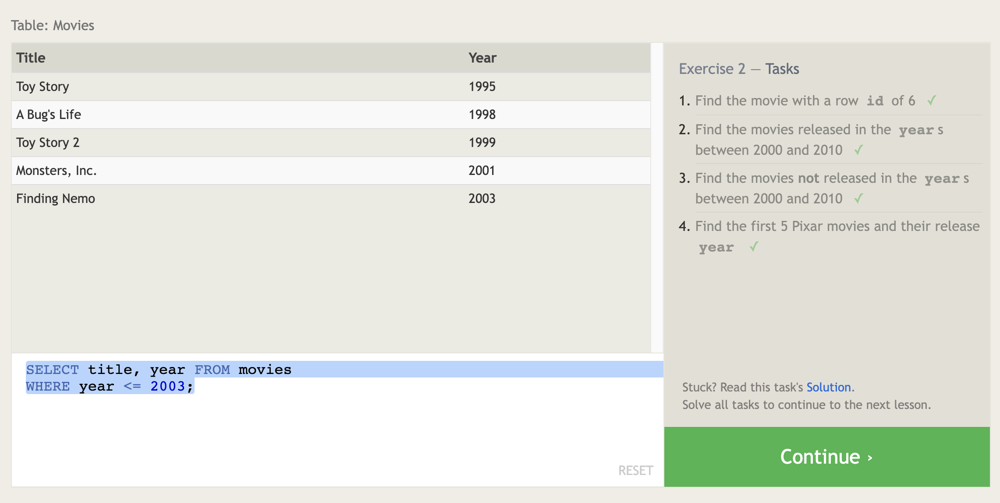
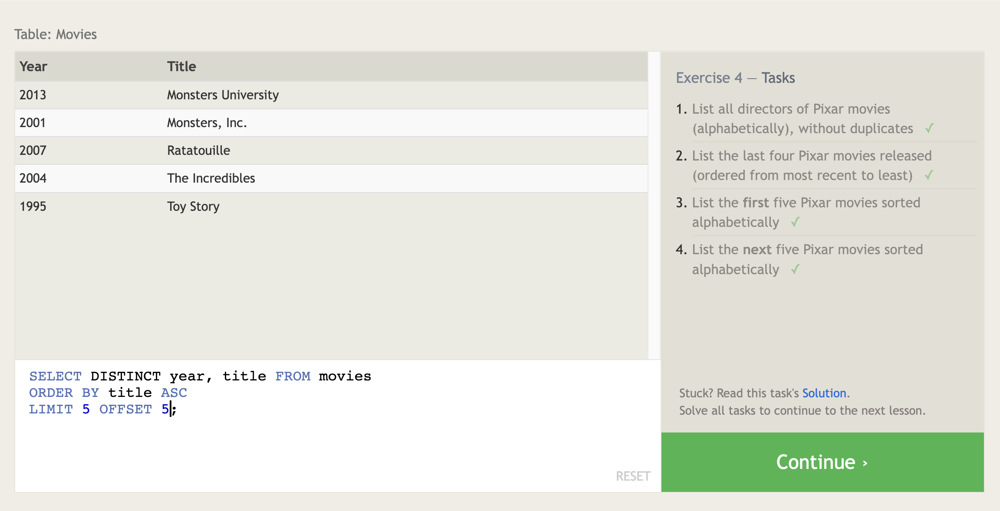
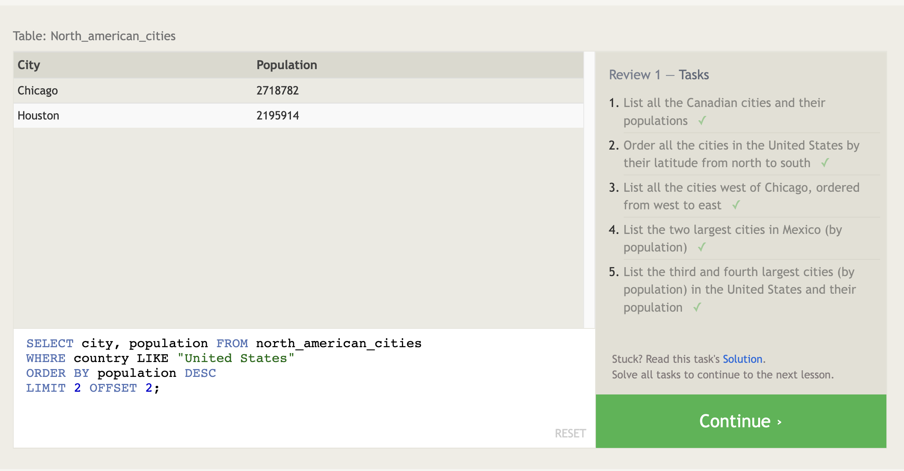
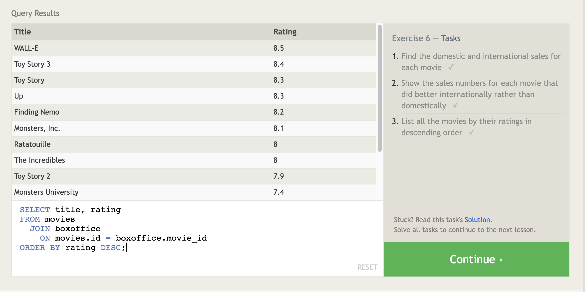
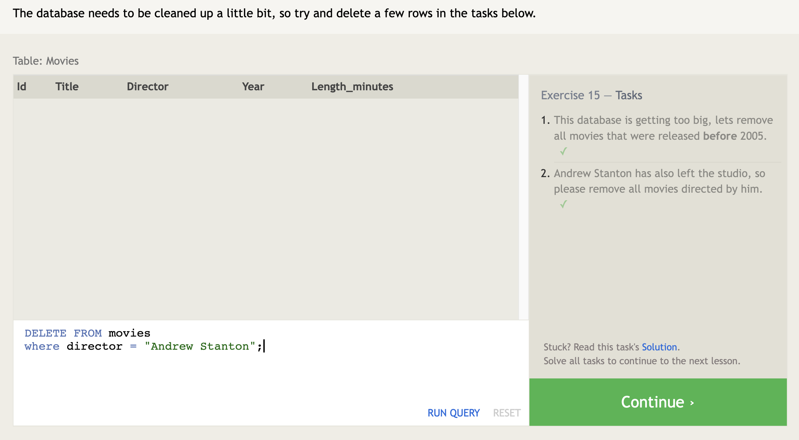
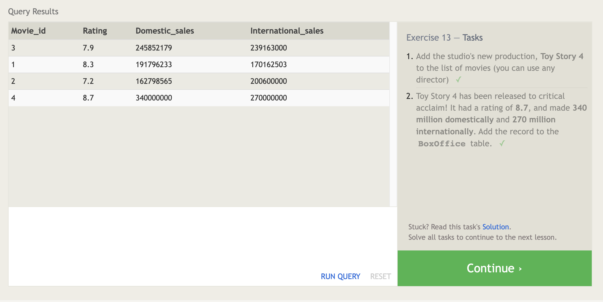
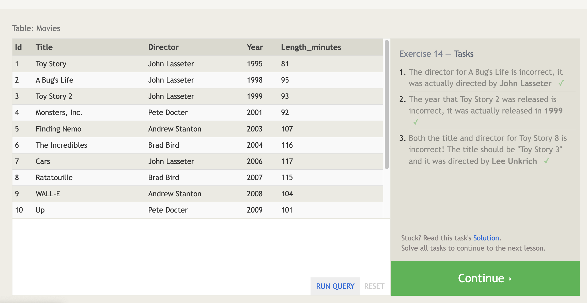

# SQL

key terms commonly used:

    1. Database: A database is a structured collection of data that is organized and stored for efficient retrieval, manipulation, and management. It can consist of one or more tables, views, procedures, and other database objects.

    2. Table: In SQL, a table is a collection of related data organized in rows and columns. Each column represents a specific attribute, and each row represents a record or a set of values for those attributes.

    3. Column: A column, also known as a field, is a vertical entity within a table that stores a specific type of data. Columns define the structure of the data and determine the type of values that can be stored.

    4. Row: A row, also called a record, is a horizontal entity within a table that represents a single instance or entry of data. It contains values for each column in the table.

    5. Primary Key: A primary key is a column or a combination of columns that uniquely identifies each row in a table. It ensures the integrity and uniqueness of data within the table.

    ```sql

    CREATE TABLE Customers (
      customer_id INT PRIMARY KEY,
     name VARCHAR(50),
     email VARCHAR(100)
    );

    ```

    6. Foreign Key: A foreign key is a column or a set of columns in a table that refers to the primary key of another table. It establishes a relationship between two tables, enforcing referential integrity.

    ```sql
    CREATE TABLE Orders (
    order_id INT PRIMARY KEY,
    customer_id INT,
    order_date DATE,
    FOREIGN KEY (customer_id) REFERENCES Customers(customer_id)
    );
    ```

    7. Index: An index is a database structure that improves the speed of data retrieval operations on a table. It allows faster searching and sorting of data based on specific columns. Indexes can be created on one or more columns of a table.

    ```sql
    CREATE INDEX idx_customers_name ON Customers (name);
    ```


    8. Query: A query is a request for data or information from a database. SQL queries are used to retrieve, insert, update, or delete data from tables. They can involve filtering, sorting, joining, aggregating, and other operations.


    9. SELECT: The SELECT statement is used to retrieve data from one or more tables in the database. It specifies the columns to be selected and can include conditions, sorting, grouping, and other clauses to manipulate the result set.

    ```sql
    SELECT column1, column2 FROM table_name;

    ```

    10. INSERT: The INSERT statement is used to insert new rows of data into a table. It specifies the table name and the values to be inserted into the columns.

    ```sql
        INSERT INTO Customers (customer_id, name, email)
        VALUES (1, 'John Doe', 'john.doe@example.com');
    ```

    11. UPDATE: The UPDATE statement is used to modify existing data in a table. It allows updating specific columns with new values based on specified conditions.

    ```sql
        UPDATE Customers
        SET email = 'johndoe@example.com'
        WHERE customer_id = 1;
    ```

    12. DELETE: The DELETE statement is used to remove one or more rows from a table based on specified conditions.

    ```sql
        DELETE FROM Customers
        WHERE customer_id = 1;
    ```

    13. JOIN: A join is used to combine rows from two or more tables based on a related column between them. It allows retrieving data from multiple tables as a single result set.

    ```sql
        SELECT Customers.name, Orders.order_date
        FROM Customers
        JOIN Orders ON Customers.customer_id = Orders.customer_id;
    ```

    14. WHERE: The WHERE clause is used to filter rows in a query based on specified conditions. It allows selecting rows that meet certain criteria.

    ```sql
        SELECT * FROM Customers
        WHERE country = 'USA';
    ```

    15. GROUP BY: The GROUP BY clause is used to group rows in a query based on one or more columns. It is often used with aggregate functions (such as SUM, COUNT, AVG) to perform calculations on grouped data.

    ```sql
        SELECT category, COUNT(*) as count FROM Products
        GROUP BY category;
    ```

    16. ORDER BY: The ORDER BY clause is used to sort the result set of a query based on one or more columns. It can sort the data in ascending or descending order.

    ```sql
        SELECT * FROM Customers
        ORDER BY last_name ASC;
    ```

    17. DISTINCT: The DISTINCT keyword is used to eliminate duplicate rows from the result set of a query. It returns only unique values.

    ```sql
        SELECT DISTINCT country FROM Customers;
    ```

# More Examples
Select



Where



Limit And Offest


LIKE

JOIN

Delete





