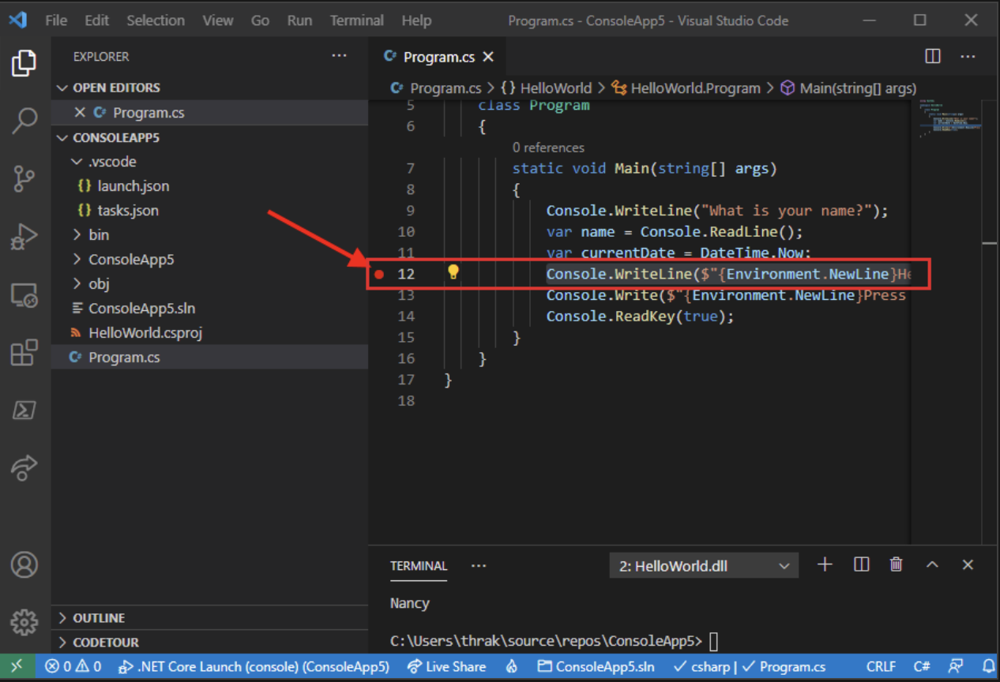

# Exception Handling

## Creating an App

Start Visual Studio Code.

Select File > Open Folder (File > Open... on macOS) from the main menu.

In the Open Folder dialog, create a HelloWorld folder and select it. Then click Select Folder (Open on macOS).

The folder name becomes the project name and the namespace name by default. You'll add code later in the tutorial that assumes the project namespace is HelloWorld.

In the Do you trust the authors of the files in this folder? dialog, select Yes, I trust the authors.

Open the Terminal in Visual Studio Code by selecting View > Terminal from the main menu.

The Terminal opens with the command prompt in the HelloWorld folder.

In the Terminal, enter the following command:

```
dotnet new console --framework net7.0
```

6. Replace the contents of Program.cs with the following code:

```cs
namespace HelloWorld
{
    class Program
    {
        static void Main(string[] args)
        {
            Console.WriteLine("Hello, World!");
        }
    }
}
```

## Run the app

Run the following command in the Terminal:

```
dotnet run
```

## C# User Input

- You have already learned that Console.WriteLine() is used to output (print) values. Now we will use Console.ReadLine() to get user input.

- In the following example, the user can input his or hers username, which is stored in the variable userName. Then we print the value of userName:

```c#

// Type your username and press enter
Console.WriteLine("Enter username:");

// Create a string variable and get user input from the keyboard and store it in the variable
string userName = Console.ReadLine();

// Print the value of the variable (userName), which will display the input value
Console.WriteLine("Username is: " + userName);

```

The Console.ReadLine() method returns a string. Therefore, you cannot get information from another data type, such as int. The following program will cause an error:

Example

```csharp
Console.WriteLine("Enter your age:");
int age = int.Parse(Console.ReadLine());
Console.WriteLine("Your age is: " + age);
```

The error message will be something like this:

**Cannot implicitly convert type 'string' to 'int'**

## C# Methods

### Create a Method

A method is defined with the name of the method, followed by parentheses (). C# provides some pre-defined methods, which you already are familiar with, such as `Main()`, but you can also create your own methods to perform certain actions:

Example:

Get your own C# Server

Create a method inside the Program class:

```csharp
class Program
{
  static void MyMethod() 
  {
    // code to be executed
  }
}
```

Example Explained

- `MyMethod()` is the name of the method

- `static` means that the method belongs to the Program class and not an object of the Program class. You will learn more about objects and how to access methods through objects later in this tutorial.

- `void` means that this method does not have a return value. You will learn more about return values later in this chapter

## Call a Method

- To call (execute) a method, write the method's name followed by two parentheses () and a semicolon;

- In the following example, MyMethod() is used to print a text (the action), when it is called:

Example:

Inside `Main()`, call the `myMethod()` method:

```csharp
static void MyMethod() 
{
  Console.WriteLine("I just got executed!");
}

static void Main(string[] args)
{
  MyMethod();
}

// Outputs "I just got executed!"
```

## Debug a .NET console application using Visual Studio Code

- Use Debug build configuration
Debug and Release are .NET's built-in build configurations. You use the Debug build configuration for debugging and the Release configuration for the final release distribution.

- In the Debug configuration, a program compiles with full symbolic debug information and no optimization. Optimization complicates debugging, because the relationship between source code and generated instructions is more complex. The release configuration of a program has no symbolic debug information and is fully optimized.

- By default, Visual Studio Code launch settings use the Debug build configuration, so you don't need to change it before debugging.

## Set a breakpoint

- Set a breakpoint on the line that displays the name, date, and time, by clicking in the left margin of the code window. The left margin is to the left of the line numbers. Other ways to set a breakpoint are by pressing F9 or choosing Run > Toggle Breakpoint from the menu while the line of code is selected.



## How to use the try/catch block to catch exceptions

Place any code statements that might raise or throw an exception in a try block, and place statements used to handle the exception or exceptions in one or more catch blocks below the try block. Each catch block includes the exception type and can contain additional statements needed to handle that exception type.

In the following example, a StreamReader opens a file called data.txt and retrieves a line from the file. Since the code might throw any of three exceptions, it's placed in a try block. Three catch blocks catch the exceptions and handle them by displaying the results to the console.

Example:

```csharp
using System;
using System.IO;

public class ProcessFile
{
    public static void Main()
    {
        try
        {
            using (StreamReader sr = File.OpenText("data.txt"))
            {
                Console.WriteLine($"The first line of this file is {sr.ReadLine()}");
            }
        }
        catch (FileNotFoundException e)
        {
            Console.WriteLine($"The file was not found: '{e}'");
        }
        catch (DirectoryNotFoundException e)
        {
            Console.WriteLine($"The directory was not found: '{e}'");
        }
        catch (IOException e)
        {
            Console.WriteLine($"The file could not be opened: '{e}'");
        }
    }
}
```


Sure! Here are explanations and code snippets for each of the C# keywords you mentioned:

1. **if**: The "if" statement allows conditional execution of code based on a Boolean expression.

```csharp
int x = 10;
if (x > 5)
{
    Console.WriteLine("x is greater than 5");
}
```

2. **switch**: The "switch" statement provides a way to execute different sections of code based on the value of an expression.

```csharp
int day = 3;
switch (day)
{
    case 1:
        Console.WriteLine("Monday");
        break;
    case 2:
        Console.WriteLine("Tuesday");
        break;
    case 3:
        Console.WriteLine("Wednesday");
        break;
    default:
        Console.WriteLine("Invalid day");
        break;
}
```

3. **do**: The "do" statement executes a block of code repeatedly until a specified condition is false.

```csharp
int count = 0;
do
{
    Console.WriteLine("Count: " + count);
    count++;
} while (count < 5);
```

4. **for**: The "for" statement provides a compact way to iterate over a range of values.

```csharp
for (int i = 0; i < 5; i++)
{
    Console.WriteLine("Iteration: " + i);
}
```

5. **foreach**: The "foreach" statement is used to iterate over elements in an array or collection.

```csharp
int[] numbers = { 1, 2, 3, 4, 5 };
foreach (int num in numbers)
{
    Console.WriteLine("Number: " + num);
}
```

6. **while**: The "while" statement executes a block of code repeatedly while a specified condition is true.

```csharp
int count = 0;
while (count < 5)
{
    Console.WriteLine("Count: " + count);
    count++;
}
```

7. **break**: The "break" statement is used to exit a loop or switch statement prematurely.

```csharp
for (int i = 0; i < 10; i++)
{
    if (i == 5)
    {
        break;
    }
    Console.WriteLine("Iteration: " + i);
}
```

8. **continue**: The "continue" statement is used to skip the rest of the current iteration in a loop and proceed to the next iteration.

```csharp
for (int i = 0; i < 5; i++)
{
    if (i == 2)
    {
        continue;
    }
    Console.WriteLine("Iteration: " + i);
}
```

9. **goto**: The "goto" statement transfers the program's control to a labeled statement.

```csharp
for (int i = 0; i < 5; i++)
{
    if (i == 2)
    {
        goto CustomLabel;
    }
    Console.WriteLine("Iteration: " + i);
}

CustomLabel:
Console.WriteLine("Custom label reached");
```

10. **return**: The "return" statement is used to exit a method and optionally return a value.

```csharp
int Sum(int a, int b)
{
    return a + b;
}

int result = Sum(5, 3);
Console.WriteLine("Sum: " + result);
```

11. **throw** (continued): The "throw" statement is used to explicitly throw an exception.

```csharp
int Divide(int dividend, int divisor)
{
    if (divisor == 0)
    {
        throw new DivideByZeroException("Divisor cannot be zero.");
    }
    return dividend / divisor;
}

try
{
    int result = Divide(10, 0);
    Console.WriteLine("Result: " + result);
}
catch (DivideByZeroException ex)
{
    Console.WriteLine("Error: " + ex.Message);
}
```

12. **try-catch**: The "try-catch" statement is used for exception handling. Code that may potentially throw an exception is placed within the "try" block, and any caught exceptions are handled in the "catch" block.

```csharp
try
{
    int result = Divide(10, 2);
    Console.WriteLine("Result: " + result);
}
catch (DivideByZeroException ex)
{
    Console.WriteLine("Error: " + ex.Message);
}
```

13. **try-finally**: The "try-finally" statement is used to guarantee that a section of code is always executed, regardless of whether an exception is thrown or not.

```csharp
try
{
    // Code that may throw an exception
}
finally
{
    // Code that always executes
}
```

14. **try-catch-finally**: The "try-catch-finally" statement combines the "try-catch" and "try-finally" statements, providing exception handling along with code that always executes.

```csharp
try
{
    // Code that may throw an exception
}
catch (Exception ex)
{
    // Exception handling
}
finally
{
    // Code that always executes
}
```

15. **checked**: The "checked" statement is used to explicitly enable overflow checking for arithmetic operations.

```csharp
checked
{
    int x = int.MaxValue;
    int y = 1;
    int sum = x + y; // This will throw an OverflowException
}
```

16. **unchecked**: The "unchecked" statement is used to explicitly disable overflow checking for arithmetic operations.

```csharp
unchecked
{
    int x = int.MaxValue;
    int y = 1;
    int sum = x + y; // This will produce an overflow and wrap around
}
```

17. **fixed**: The "fixed" statement is used to create a fixed pointer to a variable, allowing direct memory manipulation within an unsafe context.

```csharp
unsafe
{
    int[] numbers = { 1, 2, 3, 4, 5 };
    fixed (int* ptr = numbers)
    {
        // Access and modify memory directly using ptr
    }
}
```

18. **lock**: The "lock" statement is used to acquire the exclusive lock on an object, ensuring mutually exclusive access to a critical section of code.

```csharp
private static readonly object lockObj = new object();

void AccessSharedResource()
{
    lock (lockObj)
    {
        // Code that requires exclusive access to shared resource
    }
}
```

19. **yield**: The "yield" statement is used in iterator methods to return elements one at a time and maintain the state of the iterator.

```csharp
IEnumerable<int> GetNumbers()
{
    yield return 1;
    yield return 2;
    yield return 3;
}

foreach (int num in GetNumbers())
{
    Console.WriteLine("Number: " + num);
}
```

These examples demonstrate the usage of the C# keywords you mentioned. Keep in mind that some examples, such as "goto," may not be commonly used in modern programming practices and should be used with caution. Additionally, the examples provided are for illustrative purposes and may not cover all possible use cases or variations of each keyword.
