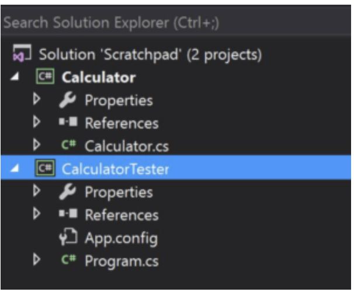

# Unit Testing

## What is Unit Testing

- Unit tests **don’t** deal with their environment and with external systems to the codebase.  If it you’ve written something that can fail when run on a machine without the “proper setup,” you haven’t written a unit test.

- Unit tests **don’t** generate random data and pepper your application with it in unpredictable sequences.

- Unit tests isolate and exercise specific units of your code.

- In C#, you can think of a unit as a method. You thus write a unit test by writing something that tests a method.

- **Don’t** create something called TestAllTheThings and then proceed to call every method in a namespace.

## Unit Testing Tutorial

```cs
public class Calculator
{
    public int Add(int x, int y)
    {
        return x + y;
    }
}

```

We have a single class, Calculator, in a class library project.  Add looks pretty reliable at first glance, but so does all the code you write.  You still need to test it, if only to prove your rightness to others.

To do that, let’s add a new console project and give it a reference to the project containing calculator, like so.



Now, let’s do the following in the main of the Calculator Tester.

```CSharp
class Program
{
    static void Main(string[] args)
    {
        var calculator = new Calculator();

        int result = calculator.Add(5, 6);

        if (result != 11)
            throw new InvalidOperationException();
    }
}
```

## Introducing a Unit Test Framework

### The Importance of Unit Testing

Here are some reasons why every developer should make unit testing a mandatory practice:

- **Catching Bugs Early**: By writing unit tests, developers can identify bugs and errors in their code much earlier in the development cycle, before they propagate to other parts of the application. This can save time and money in the long run by reducing the cost of fixing bugs later in the development cycle.

- **Improving Code Quality**: Unit testing can help improve code quality by ensuring that each unit of code is functioning correctly and as expected. This helps to prevent errors and unexpected behavior in the application.

- **Frequent Releases**: By testing code in isolation, developers can quickly identify and fix issues, allowing for faster iteration and more frequent releases.

- **Encouraging Good Programming Habits**: Writing unit tests encourages good programming habits, such as writing code that is modular, easy to understand, and testable. This can help to improve the overall quality of the codebase.

1. **Arrange, Act, Assert (AAA)**: This is a popular pattern for structuring unit tests. It emphasizes clear separation and organization of test code into three sections:
   - Arrange: Set up the necessary preconditions and inputs for the test.
   - Act: Execute the specific behavior or function being tested.
   - Assert: Verify the expected outcome and check if the actual results match the expected results.

   Following this pattern helps keep tests well-structured, readable, and maintainable.

2. **Test One Behavior per Test Method**: Each unit test should focus on a specific behavior or scenario. This allows for better isolation of issues and makes it easier to identify the cause of a test failure.

3. **Use Meaningful and Descriptive Test Names**: Choose clear and descriptive names for your tests that convey their intent and purpose. This makes it easier to understand the purpose of a test and aids in diagnosing issues when tests fail.

4. **Keep Tests Independent and Order-agnostic**: Unit tests should be independent of each other and should not rely on the execution order. Tests should not share state or have dependencies on previous tests, as this can introduce unintended side effects and make test results unpredictable.

5. **Test Boundary Conditions and Edge Cases**: Consider testing inputs at the extreme boundaries and corner cases of the expected behavior. This helps ensure that your code handles all scenarios correctly and doesn't break under specific conditions.

6. **Avoid Testing Framework-Specific Features**: Unit tests should focus on testing the logic and behavior of the code under test, rather than the specific features of the testing framework. Keep the tests independent of the testing framework to facilitate portability and reduce coupling.

7. **Test both Positive and Negative Scenarios**: Test both valid inputs and expected positive outcomes, as well as invalid inputs and expected error or exception handling. This helps ensure that your code behaves correctly in different scenarios.

8. **Keep Tests Fast and Efficient**: Unit tests should execute quickly to provide fast feedback during development. Minimize dependencies on external resources, such as databases or network services, and use mocking or stubbing techniques when needed.

9. **Regularly Review and Update Tests**: Unit tests should evolve along with the codebase. Regularly review and update tests to ensure they remain relevant and accurately reflect the behavior of the code under test.

10. **Run Tests Automatically and Frequently**: Incorporate unit tests into your continuous integration (CI) or automated build processes to run them automatically and frequently. This helps catch issues early and ensures that code changes don't introduce regressions.


## Getting Started with xUnit.net

Refer to the link

[Gettting Stated](https://xunit.net/docs/getting-started/netcore/visual-studio#create-project)


