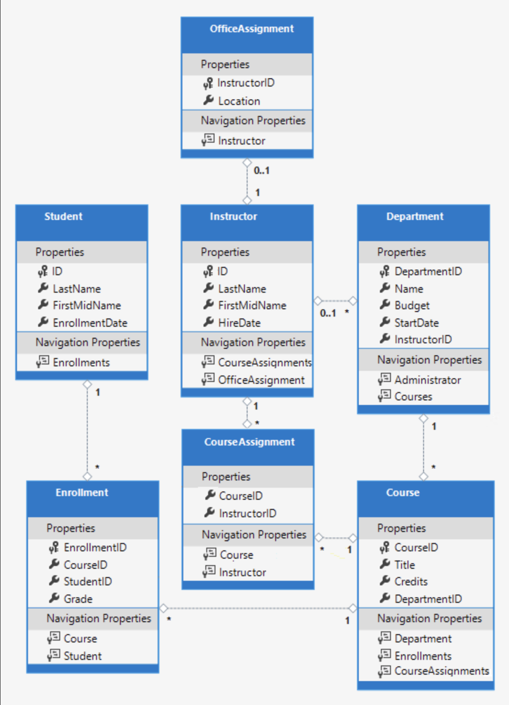
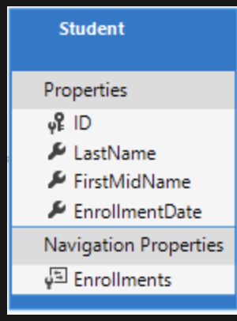

# Create a complex data model

You can customize your data model using various attributes that specify formatting, validation, and database mapping rules.



For example, you might want to format the display of date and time in your application. By using data annotation attributes, you can make one code change that will fix the display format in every view that shows the data.

```csharp
using System;
using System.Collections.Generic;
using System.ComponentModel.DataAnnotations;

namespace ContosoUniversity.Models
{
    public class Student
    {
        public int ID { get; set; }
        public string LastName { get; set; }
        public string FirstMidName { get; set; }
        [DataType(DataType.Date)]
        [DisplayFormat(DataFormatString = "{0:yyyy-MM-dd}", ApplyFormatInEditMode = true)]
        public DateTime EnrollmentDate { get; set; }

        public ICollection<Enrollment> Enrollments { get; set; }
    }
}

```

Here, we have used the `DataType` attribute to specify that we want the `EnrollmentDate` to be of data type `Date`. We have also used the `DisplayFormat` attribute to specify the format in which the date should be displayed.

You can also specify data validation rules using attributes. For instance, to ensure that users don't enter more than 50 characters for a name, we can add the `StringLength` attribute to the `LastName` and `FirstMidName` properties.

```csharp
public class Student
{
    public int ID { get; set; }
    [StringLength(50)]
    public string LastName { get; set; }
    [StringLength(50)]
    public string FirstMidName { get; set; }
    // other properties
}
```

In this case, the `StringLength` attribute will set the maximum length in the database and provide client-side and server-side validation.

To enforce more specific restrictions on the input, you can use the `RegularExpression` attribute. For example, the following code requires the first character to be upper case and the remaining characters to be alphabetical:

```csharp
[RegularExpression(@"^[A-Z]+[a-zA-Z]*$")]
public string Name { get; set; }
```

This attribute won't prevent a user from entering white space for a name, but it will ensure that the name starts with an uppercase letter followed by alphabetical characters.

If you make changes to the data model that require changes in the database schema, you can use migrations to update the schema without losing any data that you may have added to the database by using the application UI. For example, to apply the changes from the `StringLength` attribute, you would run the following commands:

```bash
dotnet ef migrations add MaxLengthOnNames
dotnet ef database update
```

This will create a new migration file and apply it to the database, updating the schema to match the new data model.

## The `Column` Attribute

The `Column` attribute allows you to control how your class properties are mapped to the database columns. For instance, even if your class property is named `FirstMidName`, you can specify that it maps to a database column named `FirstName`.

### Example:

In your `Student.cs` file, you can set up the mapping like this:

```csharp
using System;
using System.Collections.Generic;
using System.ComponentModel.DataAnnotations;
using System.ComponentModel.DataAnnotations.Schema;

namespace ContosoUniversity.Models
{
    public class Student
    {
        public int ID { get; set; }
        [StringLength(50)]
        public string LastName { get; set; }
        
        [StringLength(50)]
        [Column("FirstName")]
        public string FirstMidName { get; set; }
        
        [DataType(DataType.Date)]
        [DisplayFormat(DataFormatString = "{0:yyyy-MM-dd}", ApplyFormatInEditMode = true)]
        public DateTime EnrollmentDate { get; set; }

        public ICollection<Enrollment> Enrollments { get; set; }
    }
}
```

Here, `[Column("FirstName")]` is the attribute that maps the `FirstMidName` property of the `Student` class to the `FirstName` column in the database.



### Database Migration:

After making the above changes to your model, you'll need to update your database to reflect these changes. You can do this by creating a new migration and updating the database:

```bash
dotnet ef migrations add ColumnFirstName
dotnet ef database update
```

### Note:

> If you view the `Student` table in SQL Server Object Explorer after applying the migration, you will notice the name of the column has changed from `FirstMidName` to `FirstName`. Also, the data type has changed from `nvarchar(MAX)` to `nvarchar(50)`.

## The `Instructor` Entity

The `Instructor` entity contains several properties similar to the `Student` entity. It also has a calculated property `FullName`. In a later tutorial, this code will be refactored to eliminate redundancy by implementing inheritance.

### Updated `Instructor.cs`:

```csharp
using System;
using System.Collections.Generic;
using System.ComponentModel.DataAnnotations;
using System.ComponentModel.DataAnnotations.Schema;

namespace ContosoUniversity.Models
{
    public class Instructor
    {
        public int ID { get; set; }

        [Required]
        [Display(Name = "Last Name")]
        [StringLength(50)]
        public string LastName { get; set; }

        [Required]
        [Column("FirstName")]
        [Display(Name = "First Name")]
        [StringLength(50)]
        public string FirstMidName { get; set; }

        [DataType(DataType.Date)]
        [DisplayFormat(DataFormatString = "{0:yyyy-MM-dd}", ApplyFormatInEditMode = true)]
        [Display(Name = "Hire Date")]
        public DateTime HireDate { get; set; }

        [Display(Name = "Full Name")]
        public string FullName
        {
            get { return LastName + ", " + FirstMidName; }
        }

        public ICollection<CourseAssignment> CourseAssignments { get; set; }
        public OfficeAssignment OfficeAssignment { get; set; }
    }
}
```

### Annotations Used:

- **`Display`**: The `Display` attribute specifies the display name for the fields in the user interface. It's helpful when the property name in the model doesn't adequately describe a field.

- **`FullName` calculated property**: This is a property that is computed from the values of other properties. In this case, `FullName` is created by concatenating `LastName` and `FirstMidName`. There will not be a corresponding column in the database for this property as it only has a get accessor.

**Note**: Multiple attributes can be written on one line. So, the `HireDate` properties could also be written as follows:

```csharp
[DataType(DataType.Date), Display(Name = "Hire Date"), DisplayFormat(DataFormatString = "{0:yyyy-MM-dd}", ApplyFormatInEditMode = true)]
```

This `Instructor` entity represents a instructor in the `ContosoUniversity` database. Its properties define the columns of the database table. The `Display` attribute changes the display name for the properties in the user interface.

## The `OfficeAssignment` Entity

In the `OfficeAssignment` entity, the `InstructorID` serves as both the primary key and the foreign key. The `InstructorID` connects each `OfficeAssignment` to a specific `Instructor`. Here's what the `OfficeAssignment.cs` file should look like:

```csharp
using System.ComponentModel.DataAnnotations;
using System.ComponentModel.DataAnnotations.Schema;

namespace ContosoUniversity.Models
{
    public class OfficeAssignment
    {
        [Key]
        public int InstructorID { get; set; }
        [StringLength(50)]
        [Display(Name = "Office Location")]
        public string Location { get; set; }

        public Instructor Instructor { get; set; }
    }
}
```

The `Instructor` navigation property maintains a reference to the related `Instructor` entity. This allows for easy access to the related `Instructor`'s data.

## Key Attribute in Entity Framework

The `Key` attribute is used in Entity Framework to denote the property that represents the primary key of an entity or complex type.

### Usage:

Here is an example of the `Key` attribute being used in a model:

```csharp
public class Student
{
    [Key]
    public int StudentId { get; set; }

    public string StudentName { get; set; }
    // Other properties...
}
```

In this example, the `StudentId` property is the primary key for the `Student` entity.

### Notes:

- If a property is named `Id` or `<type name>Id`, it is treated as the primary key by convention, so the `Key` attribute is not needed in these cases. For example, in a `Customer` class, a property named `Id` or `CustomerID` would be assumed to be the primary key.
- If your primary key property does not follow this convention, you need to use the `Key` attribute to denote the primary key.
- The `Key` attribute can also be used with the `Column` attribute to configure the order of columns when a composite primary key is used.

## Database Schemas

A database schema is a logical container for database objects such as tables, views, indexes, and procedures. It provides a namespace that allows objects of the same name to be created in different schemas in the same database.

Schemas are used to organize database objects and to control the permissions that are assigned to objects. 

A schema might look like this:

```sql
CREATE SCHEMA Sales
CREATE TABLE Sales.Orders
(
    OrderID INT NOT NULL PRIMARY KEY,
    CustomerID INT NOT NULL,
    OrderDate DATE NOT NULL
)
```

In the above SQL, `Sales` is the schema, and `Orders` is a table within that schema.

## Updates to `Course.cs`

The `Course` entity now includes a foreign key property, `DepartmentID`, which points to a related `Department` entity. This property allows for simpler and more efficient updates. Here's the updated `Course.cs` file:

```csharp
using System.Collections.Generic;
using System.ComponentModel.DataAnnotations;
using System.ComponentModel.DataAnnotations.Schema;

namespace ContosoUniversity.Models
{
    public class Course
    {
        [DatabaseGenerated(DatabaseGeneratedOption.None)]
        [Display(Name = "Number")]
        public int CourseID { get; set; }

        [StringLength(50, MinimumLength = 3)]
        public string Title { get; set; }

        [Range(0, 5)]
        public int Credits { get; set; }

        public int DepartmentID { get; set; }

        public Department Department { get; set; }
        public ICollection<Enrollment> Enrollments { get; set; }
        public ICollection<CourseAssignment> CourseAssignments { get; set; }
    }
}
```

The `DatabaseGenerated` attribute is used with the `None` option for the `CourseID` property. This means that the primary key values are provided by the user, not generated by the database.

---

## The `Department` Entity

The `Department` entity includes a `Column` attribute to specify that the `Budget` property should use the SQL Server `money` type. This is an example of changing SQL data type mapping. Here's the `Department.cs` file:

```csharp
using System;
using System.Collections.Generic;
using System.ComponentModel.DataAnnotations;
using System.ComponentModel.DataAnnotations.Schema;

namespace ContosoUniversity.Models
{
    public class Department
    {
        public int DepartmentID { get; set; }

        [StringLength(50, MinimumLength = 3)]
        public string Name { get; set; }

        [DataType(DataType.Currency)]
        [Column(TypeName = "money")]
        public decimal Budget { get; set; }

        [DataType(DataType.Date)]
        [DisplayFormat(DataFormatString = "{0:yyyy-MM-dd}", ApplyFormatInEditMode = true)]
        [Display(Name = "Start Date")]
        public DateTime StartDate { get; set; }

        public int? InstructorID { get; set; }

        public Instructor Administrator { get; set; }
        public ICollection<Course> Courses { get; set; }
    }
}
```

The `Department` entity has an `InstructorID` foreign key and a `Instructor` navigation property. It also has a `Courses` navigation property that holds a collection of `Course` entities.

## Database Keys

Database keys are used to establish and identify relationships between tables and also to uniquely identify any record or row of data inside a table. 

There are several types of keys in a relational database:

### 1. Primary Key

A Primary Key is a column or set of columns in a table that uniquely identifies each row in that table. No two rows can have the same primary key value.

```csharp
public class Student
{
    [Key]
    public int StudentId { get; set; }  // Primary Key

    public string StudentName { get; set; }
    // Other properties...
}
```

### 2. Foreign Key

A Foreign Key is a column or set of columns in one table that references the primary key of another table. It is used to establish a link between the data in two tables.

```csharp
public class Enrollment
{
    public int EnrollmentId { get; set; }

    [ForeignKey("StudentId")]
    public int StudentId { get; set; }  // Foreign Key
    public Student Student { get; set; }
    // Other properties...
}
```

### 3. Composite Key

A Composite Key is a combination of two or more columns that are used to uniquely identify rows in a table when a single column is not sufficient.

```csharp
public class OrderDetail
{
    [Key, Column(Order = 1)]
    public int OrderId { get; set; }  // Part of Composite Key

    [Key, Column(Order = 2)]
    public int ProductId { get; set; }  // Part of Composite Key
    // Other properties...
}
```

### Differences and Usage

- A Primary Key uniquely identifies a record in the table. Primary Keys are used to enforce entity integrity.
- A Foreign Key is a column or combination of columns whose values match a Primary Key in a different table. Foreign Keys are used to enforce referential integrity, ensuring that the relationship between two tables remains synchronized during updates and deletes.
- A Composite Key is a key made up of two or more columns, which is necessary when a single column is not unique enough to serve as a primary key. Composite keys are used when the combination of two columns guarantees uniqueness, but individually, the columns do not.

## Relationships in a Relational Database

In a relational database, relationships enable us to prevent redundant data. A relationship could be defined as an association or interaction between two or more entities.

### 1:1 Relationship

A one-to-one (1:1) relationship is defined when one record in a table is associated with one and only one record in another table. 

For example, in a school database, each student has only one student ID, and each student ID is assigned to only one person.

```csharp
public class Student
{
    public int StudentId { get; set; }  // Primary Key
    public string StudentName { get; set; }

    public StudentDetail StudentDetail { get; set; }  // Navigation Property
}

public class StudentDetail
{
    [Key, ForeignKey("Student")]
    public int StudentId { get; set; }  // Foreign Key

    public DateTime EnrollmentDate { get; set; }
    public string Bio { get; set; }

    public Student Student { get; set; }  // Navigation Property
}
```

### Many:1 or 1:Many Relationship

A one-to-many (1:M) or many-to-one (M:1) relationship is defined when one record in a table can be associated with one or more records in another table.

For example, in a school database, a student can enroll in multiple courses, but each course can only be enrolled by one student.

```csharp
public class Course
{
    public int CourseId { get; set; }  // Primary Key
    public string CourseName { get; set; }

    public ICollection<Enrollment> Enrollments { get; set; }  // Navigation Property
}

public class Enrollment
{
    public int EnrollmentId { get; set; }  // Primary Key
    public int CourseId { get; set; }  // Foreign Key

    public Course Course { get; set; }  // Navigation Property
}
```

### Many:Many Relationship

A many-to-many (M:N) relationship is defined when one record in a table can be associated with one or more records in another table and vice versa.

For example, in a school database, a student can enroll in multiple courses and each course can have multiple students.

```csharp
public class Student
{
    public int StudentId { get; set; }  // Primary Key
    public string StudentName { get; set; }

    public ICollection<StudentCourse> StudentCourses { get; set; }  // Navigation Property
}

public class Course
{
    public int CourseId { get; set; }  // Primary Key
    public string CourseName { get; set; }

    public ICollection<StudentCourse> StudentCourses { get; set; }  // Navigation Property
}

public class StudentCourse
{
    public int StudentId { get; set; }  // Foreign Key
    public Student Student { get; set; }  // Navigation Property

    public int CourseId { get; set; }  // Foreign Key
    public Course Course { get; set; }  // Navigation Property
}
```

In the above example, the `StudentCourse` table serves as a junction table in a many-to-many relationship between `Students` and `Courses`.